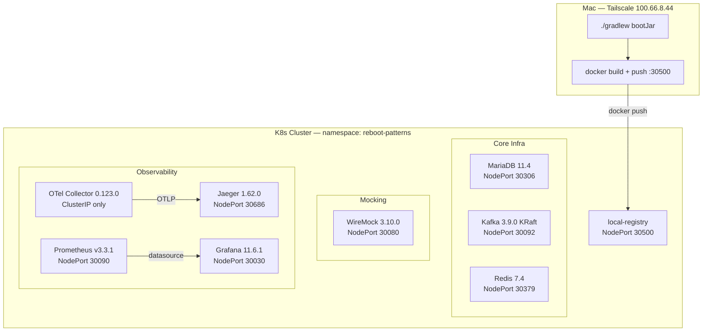
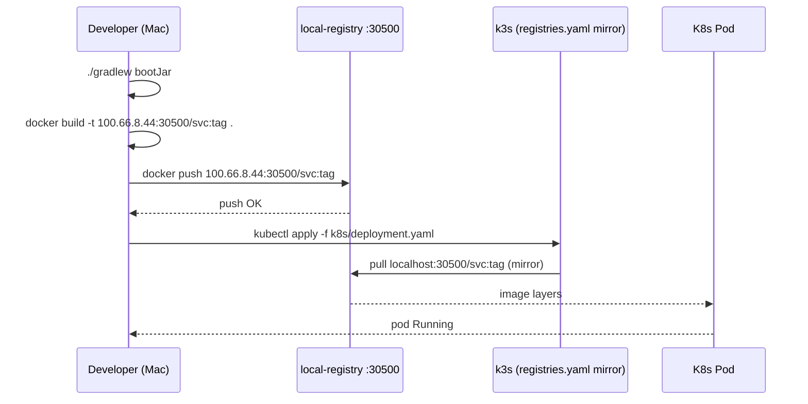
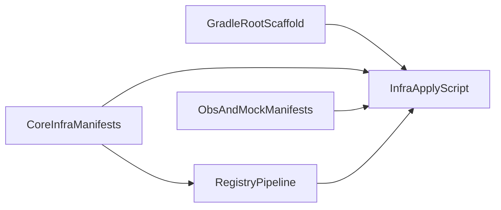

# Spec: Curriculum Infrastructure Setup

---

## Part 1 — Business Spec

### Problem Statement

Before any distributed-systems pattern can be learned and proven, the learner needs a fully working local environment: shared data and messaging infrastructure, a build system, and a pipeline to deploy services into Kubernetes. Without this foundation, no pattern can run, and no canonical-failure test can pass. This spec establishes that foundation end-to-end.

### Scope

- A single Kubernetes namespace (`reboot-patterns`) hosting all shared services the curriculum depends on.
- A Gradle root project that all 8 pattern subprojects plug into.
- A local container image registry that lets the learner push a built image from their Mac and have Kubernetes pull it automatically.
- A single script that brings up the entire shared infrastructure in one command.

### Out of Scope

- Any pattern-specific code (Pattern 1 through 8).
- Per-pattern Kubernetes Deployment manifests (those live inside each pattern subproject).
- Grafana dashboards with pre-built panels (deferred to Pattern 8).
- OpenTelemetry Collector pipeline detail (deferred to Pattern 8; only the base deployment is set up here).
- CI/CD pipelines.
- Any external network access or cloud infrastructure.

### User Stories

**US-1** — As a learner, I can run one command (`./infra/k8s/apply-all.sh`) to bring up all shared infrastructure so I can start working on a pattern without manual setup steps.

**US-2** — As a learner, I can build a Spring Boot service JAR, package it as a Docker image, push it to the local registry, and have Kubernetes pull it automatically so I can iterate on code quickly without copying files manually.

**US-3** — As a learner, I can run `./gradlew build` from the repo root so all pattern subprojects (once added) compile in a single command and share the same version catalog.

**US-4** — As a learner, I can run `reset.sh` for a pattern and have it clean that pattern's database schema, Kafka topics, and WireMock stubs so every bash test run starts from a known, clean state.

### Acceptance Criteria

**AC for US-1:**
- `kubectl get pods -n reboot-patterns` shows all shared infrastructure pods in `Running` state after running `apply-all.sh` on a fresh cluster.
- MariaDB has all 8 pattern schemas pre-created and `rebootuser` has full privileges on each.
- WireMock admin endpoint (`http://100.66.8.44:30080/__admin/mappings`) responds with HTTP 200.

**AC for US-2:**
- A developer can run `docker push 100.66.8.44:30500/<image>:<tag>` from their Mac without authentication errors.
- A pod spec referencing `localhost:30500/<image>:<tag>` starts successfully in `reboot-patterns`.

**AC for US-3:**
- `./gradlew build` succeeds at the repo root (even before any pattern subproject is added).
- All pinned versions resolve from `gradle/libs.versions.toml` without downloading unlisted versions.

**AC for US-4:**
- `source ./tests/p<N>-<pattern>/reset.sh` is idempotent — safe to run twice in succession without errors.
- After reset, the pattern's MariaDB schema exists but all tables are empty.
- After reset, no Kafka topics with the pattern's prefix exist.
- After reset, no WireMock stubs tagged `pattern: p<N>` remain.

### High-Level Flow

```mermaid
flowchart LR
    L[Learner] -->|apply-all.sh| INF[All shared infra running]
    INF -->|./gradlew build| GDL[Gradle root ready]
    GDL -->|start a pattern| P1[Write pattern code]
    P1 -->|./gradlew bootJar + docker build + push| IMG[Image in local registry]
    IMG -->|kubectl apply -f k8s/| DEP[Service in K8s]
    DEP -->|bash canonical-failure test| DONE[Pattern proven ✓]
```



### Alternatives & Trade-offs (Business-Level)

**Why Kubernetes instead of running services on the laptop directly?** The curriculum proves patterns by injecting real failures — stopping a service, killing a broker, dropping network packets. Kubernetes gives us a controlled way to do that with a single command. Running services directly on the laptop would make failure injection unpredictable and non-repeatable.

**Why a local image registry instead of a public one?** Pushing to Docker Hub requires internet access from the Kubernetes cluster and adds a credentials management step. A local registry in the cluster is private, fast, and requires no external accounts.

---

## Part 2 — Technical Assessment

### Architecture Diagram



### Workflow Diagrams

#### Image Delivery Flow (US-2)



#### Reset Flow (US-4)

```mermaid
sequenceDiagram
    participant Script as reset.sh
    participant MDB as MariaDB :30306
    participant KFK as Kafka :30092
    participant WM as WireMock :30080

    Script->>MDB: DROP SCHEMA p<N>_<pattern>; CREATE SCHEMA p<N>_<pattern>;
    MDB-->>Script: OK
    Script->>KFK: kafka-topics.sh --delete --topic p<N>.<pattern>.*
    KFK-->>Script: OK
    Script->>WM: DELETE /__admin/mappings (filter metadata.pattern=p<N>)
    WM-->>Script: 200 OK
```

### Key Technical Decisions

| Decision | Choice | Rationale |
|----------|--------|-----------|
| Services run as K8s Deployments | `kubectl scale` failure injection | `kubectl scale deployment/<svc> --replicas=0` is the canonical failure idiom — requires K8s Deployments, not local bootRun processes |
| Dockerfiles allowed (§11 relaxed) | Minimal single-stage `eclipse-temurin:21-jre` | Necessary for K8s deployment; 5-line Dockerfile is explicit and beginner-readable |
| Local image registry (NodePort 30500) | `registry:2` in-cluster | Avoids SSH + scp per deploy; Mac pushes via Tailscale IP, k3s pulls via registries.yaml mirror |
| `application.properties` (not `.yml`) | User preference | Overrides default Spring Boot convention and CLAUDE.md §4 (already updated) |
| Spring Boot 3.5.3 + Spring Cloud 2025.0.0 | Latest stable GA | Latest versions; Spring Cloud 2025.0.0 explicitly targets Boot 3.5.x |
| MariaDB schemas pre-created in init.sql | All 8 schemas + grants at boot | Flyway manages tables, not schema creation; pre-creating guarantees each pattern works without a manual DBA step |
| WireMock manifests in `mocks/deployment/` | Follows CLAUDE.md §2 layout | WireMock is a mock, not infra; keeps the distinction visible in the repo layout |
| All other infra manifests in `infra/k8s/` | Follows CLAUDE.md §2 layout | MariaDB, Kafka, Redis, Jaeger, OTel, Prometheus, Grafana, registry |

### Module Decomposition

> 💡 A deep module encapsulates significant functionality behind a simple, stable interface. Prefer fewer, deeper modules over many shallow ones. Each module below is a unit that can be developed and applied in isolation.

| Module | Responsibility | Public Interface | New / Modified | Test Seam |
|--------|---------------|-----------------|----------------|-----------|
| `GradleRootScaffold` | Root build files — Java 21 toolchain, BOM imports, shared Lombok dep, version catalog | `./gradlew build` succeeds; `libs.*` refs resolve in subprojects | New | `./gradlew dependencies` outputs correct versions |
| `CoreInfraManifests` | K8s manifests for MariaDB, Kafka, Redis — adapted from `com-reboot/reboot-common-k8s` with namespace + init.sql changes | `kubectl apply -f infra/k8s/{mariadb,kafka,redis}/` → pods Running, NodePorts reachable | New | `nc -zv 100.66.8.44 30306/30092/30379` + `mysql -h ... -e "SHOW SCHEMAS"` |
| `ObsAndMockManifests` | K8s manifests for WireMock, Jaeger, OTel Collector, Prometheus, Grafana | All pods Running, NodePorts reachable, WireMock admin 200, Jaeger UI 200 | New | `curl -s http://100.66.8.44:30080/__admin/mappings`, `curl -s http://100.66.8.44:30686` |
| `RegistryPipeline` | Local registry Deployment + k3s `registries.yaml` mirror config | `docker push 100.66.8.44:30500/:<tag>` succeeds; pod referencing image starts | New | Push a test image from Mac; create a pod that runs it; assert Running |
| `InfraApplyScript` | `infra/k8s/apply-all.sh` — ordered apply of all manifests + connectivity smoke checks | `./infra/k8s/apply-all.sh` exits 0 with all pods Running | New | Script exit code + `kubectl get pods -n reboot-patterns` |

#### Module Dependency Diagram



### Dependencies

| Dependency | Version | Source | Notes |
|-----------|---------|--------|-------|
| Spring Boot | 3.5.3 | `libs.versions.toml` | BOM imported at root |
| Spring Cloud | 2025.0.0 | `libs.versions.toml` | BOM imported at root |
| Lombok | 1.18.38 | `libs.versions.toml` | Applied at root for all subprojects |
| MapStruct | 1.6.3 | `libs.versions.toml` | Applied per subproject |
| Resilience4j | 2.3.0 | `libs.versions.toml` | Applied per subproject |
| Flyway | 11.8.2 | `libs.versions.toml` | Applied per subproject |
| Gradle wrapper | 8.11.1 | `gradle/wrapper/gradle-wrapper.properties` | Matches com-reboot baseline |
| MariaDB image | 11.4 | `infra/k8s/mariadb/` | StatefulSet |
| Kafka image | apache/kafka:3.9.0 | `infra/k8s/kafka/` | KRaft mode StatefulSet |
| Redis image | redis:7.4 | `infra/k8s/redis/` | Deployment |
| WireMock image | wiremock/wiremock:3.10.0 | `mocks/deployment/` | Deployment |
| Jaeger image | jaegertracing/all-in-one:1.62.0 | `infra/k8s/jaeger/` | Deployment |
| OTel Collector | otel/opentelemetry-collector-contrib:0.123.0 | `infra/k8s/otel-collector/` | Deployment, ClusterIP only |
| Prometheus | prom/prometheus:v3.3.1 | `infra/k8s/prometheus/` | Deployment |
| Grafana | grafana/grafana:11.6.1 | `infra/k8s/grafana/` | Deployment |
| Local registry | registry:2 | `infra/k8s/registry/` | Deployment, NodePort 30500 |
| k3s node | Rocky Linux 9.6 / k3s v1.33.6 | Host | Tailscale IP 100.66.8.44 |

> ℹ️ **1 manday = 1 hour** (~2 sessions × 30 minutes). All estimates below use this unit.

### Task Breakdown

#### Slice 0: Repo Foundation

Bootstrap the build system. No business logic — enables all subsequent pattern subproject work.

| # | Task | Complexity | Mandays | Risk | Covers |
|---|------|-----------|---------|------|--------|
| 1 | Update CLAUDE.md §1, §4, §11 (service model, `application.properties`, Dockerfiles allowed) | Low | 0 | None | Foundation |
| 2 | Create `settings.gradle` with root project name and 8 subproject includes (commented out until each pattern starts) | Low | 0.5 | None | US-3 |
| 3 | Create root `build.gradle` with Java 21 toolchain, Spring Boot plugin (`apply false`), `io.spring.dependency-management` plugin (`apply false`), Lombok applied to all subprojects | Medium | 1 | Spring Cloud 2025.0.0 + Boot 3.5.3 is a new version pair — verify BOM import resolves cleanly | US-3 |
| 4 | Create `gradle/libs.versions.toml` with all pinned versions (Boot 3.5.3, Cloud 2025.0.0, Lombok 1.18.38, MapStruct 1.6.3, Resilience4j 2.3.0, Flyway 11.8.2) and library aliases | Medium | 0.5 | None | US-3 |
| 5 | Commit Gradle wrapper 8.11.1 (`gradlew`, `gradlew.bat`, `gradle/wrapper/`) | Low | 0.5 | None | US-3 |

Subtotal: **2.5 mandays**

> Note: Task 1 (CLAUDE.md update) was already completed during the `/grill-me` session. Counted here for traceability; 0 mandays remaining.

#### Slice 1: Core Data & Messaging Infra

Adapt MariaDB, Kafka, and Redis K8s manifests from `com-reboot/reboot-common-k8s`. After this slice, all three are running in `reboot-patterns` with correct schemas and NodePorts.

| # | Task | Complexity | Mandays | Risk | Covers |
|---|------|-----------|---------|------|--------|
| 6 | Adapt MariaDB manifests (`infra/k8s/mariadb/`): Secret (`rebootuser`/`abc@123`), ConfigMap (`my.cnf` + init.sql creating all 8 pattern schemas with grants), StatefulSet (`mariadb:11.4`, PVC 5Gi), NodePort Service 30306 | Medium | 1 | init.sql must create schemas before Flyway runs — ordering is guaranteed by StatefulSet readiness probe | US-1, US-4 |
| 7 | Adapt Kafka manifests (`infra/k8s/kafka/`): StatefulSet (`apache/kafka:3.9.0`, KRaft, `KAFKA_ADVERTISED_LISTENERS: PLAINTEXT://100.66.8.44:30092`, PVC 2Gi), headless ClusterIP Service, NodePort Service 30092 | Medium | 1 | Hardcoded Tailscale IP — if IP changes, manifest must be updated manually | US-1 |
| 8 | Adapt Redis manifests (`infra/k8s/redis/`): Secret, Deployment (`redis:7.4`, `--requirepass`, `--appendonly yes`), NodePort Service 30379 | Low | 0.5 | None | US-1 |

Subtotal: **2.5 mandays**

#### Slice 2: Observability & Mock Stack

New manifests for WireMock, Jaeger, OTel Collector, Prometheus, and Grafana. After this slice, the full observability and mocking surface is available.

| # | Task | Complexity | Mandays | Risk | Covers |
|---|------|-----------|---------|------|--------|
| 9 | WireMock manifests (`mocks/deployment/`): Deployment (`wiremock/wiremock:3.10.0`, `--global-response-templating`), NodePort Service 30080. Create `mocks/stubs/` directory with placeholder `README.md` for permanent stubs | Low | 1 | None | US-1, US-4 |
| 10 | Jaeger manifests (`infra/k8s/jaeger/`): Deployment (`jaegertracing/all-in-one:1.62.0`), NodePort Service 30686 (UI) + ClusterIP for OTLP (4317) | Low | 0.5 | None | US-1 |
| 11 | OTel Collector manifests (`infra/k8s/otel-collector/`): ConfigMap with pipeline config (OTLP receiver → Jaeger exporter), Deployment (`otel/opentelemetry-collector-contrib:0.123.0`), ClusterIP Service (4317 gRPC, 4318 HTTP) | Medium | 1 | Minimal pipeline config only — detailed instrumentation deferred to Pattern 8 | US-1 |
| 12 | Prometheus manifests (`infra/k8s/prometheus/`): ConfigMap (`prometheus.yml` with scrape config for `reboot-patterns` pods via annotation `prometheus.io/scrape: "true"`), Deployment (`prom/prometheus:v3.3.1`), NodePort Service 30090 | Medium | 1 | Scrape config must be correct before any service emits metrics | US-1 |
| 13 | Grafana manifests (`infra/k8s/grafana/`): ConfigMap for Prometheus datasource auto-provisioning, Deployment (`grafana/grafana:11.6.1`), NodePort Service 30030 | Low | 0.5 | None | US-1 |

Subtotal: **4 mandays**

#### Slice 3: Image Delivery Pipeline

Local container registry in the cluster + k3s mirror configuration. After this slice, `docker push 100.66.8.44:30500/<image>` from Mac → pods pull it automatically.

| # | Task | Complexity | Mandays | Risk | Covers |
|---|------|-----------|---------|------|--------|
| 14 | Registry manifests (`infra/k8s/registry/`): Deployment (`registry:2`, PVC or emptyDir for image storage), NodePort Service 30500. **Port 30500 must be opened on Tailscale/firewall by user before this works.** | Low | 0.5 | Port 30500 must be explicitly opened — push will time out silently if not done | US-2 |
| 15 | Configure k3s `registries.yaml` on Rocky Linux node: mirror `100.66.8.44:30500` → `localhost:30500`, restart k3s service. Document steps in `infra/k8s/registry/README.md` | Medium | 1 | One-time manual step on the Rocky Linux node (SSH required); if skipped, pod image pulls fail with `ImagePullBackOff` | US-2 |

Subtotal: **1.5 mandays**

#### Slice 4: Infra Orchestration Script

Single script that applies everything in dependency order and verifies connectivity. After this slice, US-1 is fully complete.

| # | Task | Complexity | Mandays | Risk | Covers |
|---|------|-----------|---------|------|--------|
| 16 | Write `infra/k8s/apply-all.sh`: apply manifests in order (namespace → core infra → registry → observability → mocks), wait for each StatefulSet/Deployment to be Ready, run smoke checks (`nc -zv` for each NodePort, `curl` WireMock admin, `mysql` schema check) | Medium | 1 | Script must handle k3s image pulls for new images (may be slow on first run) | US-1 |

Subtotal: **1 manday**

### Total Estimate & Critical Path

| Slice | Mandays |
|-------|---------|
| Slice 0: Repo Foundation | 2.5 (0 remaining — Task 1 done) |
| Slice 1: Core Data & Messaging Infra | 2.5 |
| Slice 2: Observability & Mock Stack | 4.0 |
| Slice 3: Image Delivery Pipeline | 1.5 |
| Slice 4: Infra Orchestration Script | 1.0 |
| **Total** | **11.5 mandays (~11.5 hours)** |

**Critical path:** Slice 0 → Slice 1 → Slice 3 → Slice 4. Slice 2 (observability) can be done in parallel with Slice 3 after Slice 1 completes. Pattern 1 can begin after Slice 0, Slice 1, Slice 3, and Slice 4 are done — Pattern 1 does not require observability.

### Risk Assessment

#### High Risks
- **Spring Cloud 2025.0.0 + Boot 3.5.3 version pair** — this is a very recent combination. Spring Cloud Kubernetes Discovery in 2025.0.0 may have undiscovered incompatibilities with the k3s Kubernetes API version (v1.33.6). Mitigation: verify `./gradlew dependencies` resolves cleanly before writing any pattern code.
- **k3s `registries.yaml` misconfiguration** — if the mirror is wrong, all pod image pulls fail silently with `ImagePullBackOff`. Mitigation: test with a known image (e.g., `nginx`) before using for pattern services.

#### Medium Risks
- **Tailscale IP stability** — `100.66.8.44` is referenced in the Kafka `KAFKA_ADVERTISED_LISTENERS` manifest and in all NodePort access instructions. If the Tailscale IP changes, Kafka will stop accepting external connections. Mitigation: document the IP in `infra/k8s/README.md`; check with `tailscale ip` before any session.
- **Port 30500 not opened** — `docker push` to the registry NodePort will time out with no clear error if the Tailscale/firewall rule is not in place. Mitigation: `apply-all.sh` smoke check should test port 30500 and fail loudly.

#### Mitigation Strategies
- Run `./gradlew dependencies` immediately after creating the version catalog — catch BOM resolution errors before any code is written.
- Run `apply-all.sh` smoke checks after every manifest change — port connectivity is the earliest signal of misconfiguration.
- Document the Tailscale IP and k3s setup steps explicitly in `infra/k8s/README.md` so they're visible before any session.

---

## Part 3 — Issue-Ready Breakdown

### Slice 0: Repo Foundation

Bootstraps the Gradle build system. Enables all subsequent pattern subproject work. All issues in this slice must be completed before any pattern subproject is created.

#### ISSUE-1: Create Gradle root scaffold

- **Description:** Create `settings.gradle`, root `build.gradle`, `gradle/libs.versions.toml`, and commit the Gradle 8.11.1 wrapper. The root build applies Java 21 toolchain and Lombok globally; all version pins live in the catalog. CLAUDE.md §4 and §11 were already updated in the `/grill-me` session.
- **User Stories:** US-3
- **Modules touched:** `GradleRootScaffold` (new)
- **Public Interface:** `./gradlew build` from repo root
- **Behaviors to verify (in priority order):**
  1. `./gradlew build` exits 0 on a clean checkout with no subprojects yet declared
  2. `./gradlew dependencies` shows Spring Boot 3.5.3 and Spring Cloud 2025.0.0 BOM entries resolved without conflict
  3. Adding a minimal subproject that declares `implementation libs.spring.boot.starter` resolves the correct version from the catalog without specifying a version string
- **Acceptance Criteria:** `./gradlew build` succeeds. `gradle/libs.versions.toml` contains all required version aliases. Wrapper scripts are executable and point to 8.11.1.
- **Estimated Mandays:** 2.5
- **Dependencies:** None
- **Risk:** Medium — Spring Cloud 2025.0.0 + Boot 3.5.3 is a new version pair; BOM resolution must be verified

---

### Slice 1: Core Data & Messaging Infra

Adapts and deploys MariaDB, Kafka, and Redis into `reboot-patterns`. After completing this slice: all three pods are Running, NodePorts are reachable, and MariaDB has all 8 pattern schemas.

#### ISSUE-2: Adapt and deploy MariaDB to reboot-patterns

- **Description:** Adapt manifests from `com-reboot/reboot-common-k8s/mariadb/` into `infra/k8s/mariadb/`. Change namespace to `reboot-patterns`. Replace init.sql to pre-create all 8 pattern schemas (`p1_gateway`, `p2_resilience`, `p3_outbox`, `p4_saga_choreography`, `p5_saga_orchestration`, `p6_cqrs`, `p7_idempotency_dlq`, `p8_observability`) and grant all privileges to `rebootuser`. Keep credentials (`rebootuser`/`abc@123`), image (`mariadb:11.4`), and PVC size (5Gi) unchanged.
- **User Stories:** US-1, US-4
- **Modules touched:** `CoreInfraManifests` (new)
- **Public Interface:** `nc -zv 100.66.8.44 30306` / `mysql -h 100.66.8.44 -P 30306 -u rebootuser -pabc@123 -e "SHOW SCHEMAS"`
- **Behaviors to verify (in priority order):**
  1. MariaDB pod is `Running` after `kubectl apply -f infra/k8s/mariadb/`
  2. `SHOW SCHEMAS` returns all 8 pattern schemas
  3. `rebootuser` can `CREATE TABLE` in `p1_gateway` without errors
  4. Reapplying the manifests (`kubectl apply` again) is idempotent — no errors, pod does not restart
- **Acceptance Criteria:** All 8 schemas exist. `rebootuser` has full privileges on each. NodePort 30306 is reachable from Mac.
- **Estimated Mandays:** 1
- **Dependencies:** ISSUE-1 (namespace exists via apply-all.sh, but manifest itself has no Gradle dependency)
- **Risk:** Low

#### ISSUE-3: Adapt and deploy Kafka to reboot-patterns

- **Description:** Adapt manifests from `com-reboot/reboot-common-k8s/kafka/` into `infra/k8s/kafka/`. Change namespace to `reboot-patterns`. Verify `KAFKA_ADVERTISED_LISTENERS` is set to `PLAINTEXT://100.66.8.44:30092` (Tailscale IP — already correct in source). Keep image (`apache/kafka:3.9.0`), KRaft config, and PVC size (2Gi) unchanged.
- **User Stories:** US-1
- **Modules touched:** `CoreInfraManifests` (new)
- **Public Interface:** `nc -zv 100.66.8.44 30092`
- **Behaviors to verify (in priority order):**
  1. Kafka pod is `Running` after `kubectl apply -f infra/k8s/kafka/`
  2. A producer can connect to `100.66.8.44:30092` and publish a test message without error
  3. A consumer on the same broker receives the test message
- **Acceptance Criteria:** Kafka pod Running. NodePort 30092 reachable from Mac. Test produce + consume succeeds.
- **Estimated Mandays:** 1
- **Dependencies:** None (independent of other infra)
- **Risk:** Low — manifests are proven; only namespace changes

#### ISSUE-4: Adapt and deploy Redis to reboot-patterns

- **Description:** Adapt manifests from `com-reboot/reboot-common-k8s/redis/` into `infra/k8s/redis/`. Change namespace to `reboot-patterns`. Keep credentials (`abc@123`), image (`redis:7.4`), and config (`--appendonly yes`, `--requirepass`) unchanged.
- **User Stories:** US-1
- **Modules touched:** `CoreInfraManifests` (new)
- **Public Interface:** `redis-cli -h 100.66.8.44 -p 30379 -a abc@123 PING`
- **Behaviors to verify (in priority order):**
  1. Redis pod is `Running` after `kubectl apply -f infra/k8s/redis/`
  2. `redis-cli PING` returns `PONG`
  3. `SET` and `GET` with the password succeed
- **Acceptance Criteria:** Redis pod Running. NodePort 30379 reachable. Auth works.
- **Estimated Mandays:** 0.5
- **Dependencies:** None
- **Risk:** Low

---

### Slice 2: Observability & Mock Stack

New manifests for WireMock, Jaeger, OTel Collector, Prometheus, and Grafana. After completing this slice: the full observability and mocking surface is available at their respective NodePorts.

#### ISSUE-5: Deploy WireMock and create mocks directory structure

- **Description:** Write WireMock K8s manifests in `mocks/deployment/` (Deployment: `wiremock/wiremock:3.10.0` with `--global-response-templating`, Service: NodePort 30080). Create `mocks/stubs/` directory with a `README.md` explaining it holds permanent cross-pattern stubs (payment gateway, email gateway) loaded at WireMock boot. No stub JSON files yet — those are added per-pattern.
- **User Stories:** US-1, US-4
- **Modules touched:** `ObsAndMockManifests` (new)
- **Public Interface:** `curl -s http://100.66.8.44:30080/__admin/mappings`
- **Behaviors to verify (in priority order):**
  1. WireMock pod is `Running` after `kubectl apply -f mocks/deployment/`
  2. `GET /__admin/mappings` returns HTTP 200 with an empty mappings array
  3. A stub POSTed to `/__admin/mappings` with `metadata.pattern: p1` is returned in the mappings list and is deletable by `DELETE /__admin/mappings` filtered on that metadata
- **Acceptance Criteria:** WireMock Running. NodePort 30080 reachable. Admin API functional.
- **Estimated Mandays:** 1
- **Dependencies:** None
- **Risk:** Low

#### ISSUE-6: Deploy Jaeger and OTel Collector

- **Description:** Write Jaeger manifests in `infra/k8s/jaeger/` (Deployment: `jaegertracing/all-in-one:1.62.0`, Service: NodePort 30686 for UI + ClusterIP for OTLP port 4317). Write OTel Collector manifests in `infra/k8s/otel-collector/` (ConfigMap: minimal pipeline — OTLP gRPC receiver → Jaeger exporter; Deployment: `otel/opentelemetry-collector-contrib:0.123.0`; ClusterIP Service: 4317 gRPC + 4318 HTTP). Collector exports to Jaeger via in-cluster hostname.
- **User Stories:** US-1
- **Modules touched:** `ObsAndMockManifests` (new)
- **Public Interface:** `curl -s http://100.66.8.44:30686` (Jaeger UI)
- **Behaviors to verify (in priority order):**
  1. Both pods are `Running`
  2. Jaeger UI returns HTTP 200 at NodePort 30686
  3. A synthetic OTLP span sent to OTel Collector ClusterIP:4317 appears in Jaeger UI within 5 seconds
- **Acceptance Criteria:** Jaeger UI accessible. OTel Collector → Jaeger pipeline verified with a synthetic span.
- **Estimated Mandays:** 1.5
- **Dependencies:** None (independent of core infra for deployment)
- **Risk:** Medium — OTel Collector config must correctly reference Jaeger in-cluster hostname

#### ISSUE-7: Deploy Prometheus and Grafana

- **Description:** Write Prometheus manifests in `infra/k8s/prometheus/` (ConfigMap: `prometheus.yml` with global scrape interval 15s and a Kubernetes SD config scraping pods annotated with `prometheus.io/scrape: "true"` in `reboot-patterns`; Deployment: `prom/prometheus:v3.3.1`; NodePort Service 30090). Write Grafana manifests in `infra/k8s/grafana/` (ConfigMap: datasource provisioning pointing to `http://prometheus:30090`; Deployment: `grafana/grafana:11.6.1`; NodePort Service 30030).
- **User Stories:** US-1
- **Modules touched:** `ObsAndMockManifests` (new)
- **Public Interface:** `curl -s http://100.66.8.44:30090/-/ready` (Prometheus) + `curl -s http://100.66.8.44:30030/api/health` (Grafana)
- **Behaviors to verify (in priority order):**
  1. Both pods are `Running`
  2. Prometheus `/targets` shows the Kubernetes SD job active (even if no targets yet)
  3. Grafana health endpoint returns `{"database":"ok"}`
  4. Grafana UI has Prometheus listed as a datasource
- **Acceptance Criteria:** Both services Running and reachable. Grafana datasource pre-wired.
- **Estimated Mandays:** 1.5
- **Dependencies:** None
- **Risk:** Low

---

### Slice 3: Image Delivery Pipeline

Local container registry in the cluster + k3s mirror configuration. After completing this slice, `docker push 100.66.8.44:30500/<image>:<tag>` from Mac → Kubernetes can pull it.

#### ISSUE-8: Deploy local registry and configure k3s mirror

- **Description:** Write registry manifests in `infra/k8s/registry/` (Deployment: `registry:2` with emptyDir volume for image storage; NodePort Service 30500). Configure `/etc/rancher/k3s/registries.yaml` on the Rocky Linux node to mirror `100.66.8.44:30500` → `localhost:30500`; restart k3s service. Document steps in `infra/k8s/registry/README.md`. **Prerequisite: port 30500 must be opened on the Tailscale/firewall layer before testing.**
- **User Stories:** US-2
- **Modules touched:** `RegistryPipeline` (new)
- **Public Interface:** `docker push 100.66.8.44:30500/<image>:<tag>`
- **Behaviors to verify (in priority order):**
  1. Registry pod is `Running`
  2. `docker push 100.66.8.44:30500/test-nginx:latest` (push `nginx` image from Mac) succeeds with no auth errors
  3. A pod spec with `image: localhost:30500/test-nginx:latest` starts successfully in `reboot-patterns`
  4. Removing the pod and re-creating it pulls the image from the local registry (no `ImagePullBackOff`)
- **Acceptance Criteria:** Push + pull round-trip verified. k3s mirror config in place. Port 30500 open.
- **Estimated Mandays:** 1.5
- **Dependencies:** None for manifest; k3s node access required for registries.yaml
- **Risk:** High — k3s `registries.yaml` misconfiguration causes `ImagePullBackOff` with no clear error; port 30500 must be opened before testing

---

### Slice 4: Infra Orchestration Script

A single script to apply all manifests in correct order and verify connectivity. Completes US-1.

#### ISSUE-9: Write infra/k8s/apply-all.sh with smoke checks

- **Description:** Write `infra/k8s/apply-all.sh` that: (1) creates/ensures `reboot-patterns` namespace, (2) applies all manifests in order (core infra → registry → observability → mocks), (3) waits for each StatefulSet and Deployment to reach Ready state via `kubectl rollout status`, (4) runs smoke checks: `nc -zv 100.66.8.44` for ports 30306, 30092, 30379, 30080, 30686, 30090, 30030, 30500; `curl -sf http://100.66.8.44:30080/__admin/mappings`; MySQL schema existence check. Script exits 1 loudly on any failure.
- **User Stories:** US-1
- **Modules touched:** `InfraApplyScript` (new)
- **Public Interface:** `./infra/k8s/apply-all.sh` exit code + output
- **Behaviors to verify (in priority order):**
  1. Script exits 0 on a cluster where all components are already Running (idempotent re-apply)
  2. Script exits 1 with a clear error message if any NodePort is unreachable
  3. Script exits 1 with a clear error message if MariaDB schema check fails
  4. Running the script twice in a row produces no errors (idempotent)
- **Acceptance Criteria:** Single command brings up and verifies the entire shared infra. Exit 0 = ready to start Pattern 1.
- **Estimated Mandays:** 1
- **Dependencies:** ISSUE-2, ISSUE-3, ISSUE-4, ISSUE-5, ISSUE-6, ISSUE-7, ISSUE-8
- **Risk:** Low — pure orchestration; complexity is in the individual manifests, not the script
