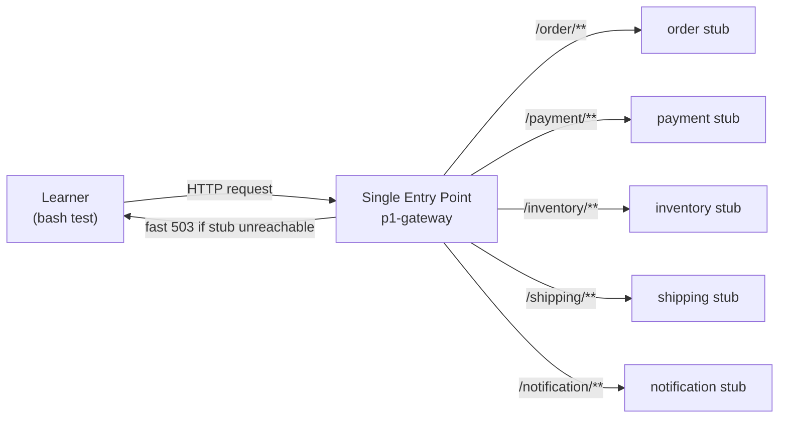
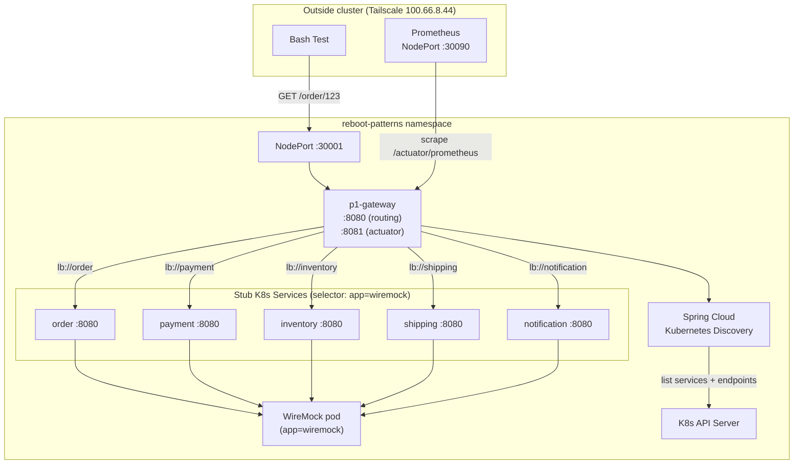
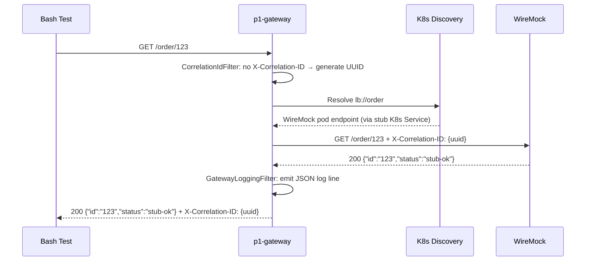
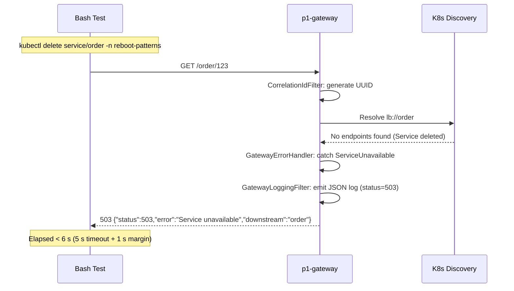
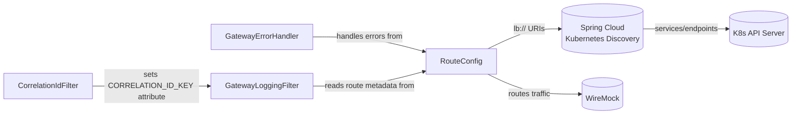

# Spec: API Gateway + Service Discovery (p1-gateway)

---

## Part 1 — Business Spec

### Problem Statement

The Reboot-Patterns curriculum teaches distributed systems by building one service at a time. Every service in the curriculum needs a single, stable address to receive requests. Without a gateway, each bash test would need to know the address of every individual service — and every time a service moves or is rebuilt, every test would break.

This pattern solves that by providing a **front door**: one address, one place to send requests, and automatic routing to the right service. It is the foundation the rest of the curriculum builds on.

### Scope

The system will:
- Accept HTTP requests at a single address and forward them to the correct service based on the request path.
- Automatically discover where downstream services are running without any manual configuration updates.
- Add a tracking identifier to every request so it can be followed end-to-end.
- Return a clear, fast error when a downstream service is unreachable — never leaving the caller waiting indefinitely.
- Expose its own health status and basic performance numbers so the platform can monitor it.

### Out of Scope

The system will **not**:
- Check who is making the request (no authentication or authorisation).
- Retry a failed request or apply circuit-breaking logic — that is the job of Pattern 2.
- Transform request or response bodies.
- Secure traffic with HTTPS.
- Cache responses.
- Route to real downstream services — stubs stand in for all of them during this pattern.

### User Stories

**US-1 — Single entry point**
As a learner, I can send all HTTP requests to one gateway address and have them forwarded to the right downstream service by path, so I never need to know individual service addresses.

**US-2 — Request traceability**
As a learner, I can see a correlation identifier in the gateway's logs and in what the downstream service received, so I can trace a single request without attaching a debugger.

**US-3 — Fast failure**
As a learner, when I stop a downstream service, I receive a clear error response within a few seconds — never a hanging request — so I understand how a front door protects callers from slow or dead backends.

**US-4 — Self-healing discovery**
As a learner, when a downstream service pod is replaced or restarted, the next request still routes correctly without restarting or reconfiguring the gateway, so I see Kubernetes-native discovery working in practice.

**US-5 — Operational visibility**
As a learner, I can observe the gateway's health and request metrics without writing any extra code, so I understand the observability foundation that all later patterns build on.

### Acceptance Criteria

**AC for US-1:** A `GET /order/123` request sent to the gateway returns the downstream stub's response unchanged. The same holds for `/payment/**`, `/inventory/**`, `/shipping/**`, and `/notification/**`.

**AC for US-2:** A request sent without a correlation ID receives one in the response header. A request sent with a correlation ID has that same value echoed back and forwarded to the downstream stub.

**AC for US-3:** After the `order` K8s Service is deleted, a `GET /order/123` returns HTTP 503 with a machine-readable error body within 6 seconds. A concurrent `GET /payment/123` returns 200 — the failure is isolated to the unavailable route.

**AC for US-4:** After `kubectl rollout restart deployment/wiremock`, the next request to the gateway routes correctly without a gateway restart.

**AC for US-5:** `GET <gateway>:8081/actuator/health` returns 200. `GET <gateway>:8081/actuator/prometheus` returns a Prometheus-formatted metric payload containing request count and latency data.

### High-Level Flow



### Alternatives & Trade-offs (Business-Level)

**Why not connect directly to each service?** Hard-coding five addresses in tests means every future pattern change risks breaking earlier tests. One stable front door keeps all tests isolated from service location changes.

**Why not add retry logic now?** The curriculum deliberately separates concerns. Pattern 1 teaches routing and discovery. Pattern 2 teaches resilience. Mixing them in Pattern 1 would obscure both lessons.

**Why use stubs instead of real services?** No real domain services exist yet. Stubs let us prove the gateway works correctly before any business logic is written, which is the whole point of building patterns in order.

---

## Part 2 — Technical Assessment

> ℹ️ **Estimation unit:** 1 manday = 1 hour (~2 sessions × 30 minutes).

### Architecture Diagram



### Workflow Diagrams

#### Happy Path — Request routed to downstream stub



#### Canonical Failure — Downstream service unreachable



### Key Technical Decisions

| Decision | Choice | Rationale |
|----------|--------|-----------|
| Gateway framework | Spring Cloud Gateway (reactive, Netty) | Frozen by CLAUDE.md. Reactive stack matches Spring Cloud Kubernetes Discovery's reactive client. |
| Service discovery | `spring-cloud-starter-kubernetes-client-all` (Fabric8 K8s client) | Frozen by CLAUDE.md. No Eureka. Uses Kubernetes Services/Endpoints API natively. |
| WireMock integration | 5 stub K8s Services (`selector: app: wiremock`) | Real discovery works end-to-end. No hacks in gateway config. WireMock differentiates by path. |
| Route paths | Match service name: `/order/**`, `/payment/**`, `/inventory/**`, `/shipping/**`, `/notification/**` | 1:1 mapping to K8s Service names; avoids pluralisation edge cases. No prefix stripping — full path forwarded. |
| Correlation ID header | `X-Correlation-ID` | Self-documenting; does not conflict with B3/W3C tracing headers used by p8. |
| Timeout | 5 seconds (global HTTP client timeout) | Safe for slow local machines; short enough for the fast-503 promise to be meaningful. |
| 503 body | `{"status":503,"error":"Service unavailable","downstream":"<name>"}` | Machine-readable; bash test can assert both status and which downstream failed. |
| Gateway NodePort | `30001` | Establishes `p<N> → 3000<N>` convention for all 8 patterns. |
| Actuator port | `8081` (separate management port) | Separates Prometheus scrape traffic from gateway routing traffic. |
| Structured logs | `logstash-logback-encoder` (JSON to stdout) | Machine-readable; bash tests use `jq` to assert on log fields. Fields: method, path, downstream, status, latencyMs, correlationId. |
| RBAC | Namespaced `Role` + `RoleBinding` | Least privilege — gateway only discovers services in `reboot-patterns`. No need for a ClusterRole. |
| Canonical-failure injection | `kubectl delete service/order -n reboot-patterns` | Approved idiom per CLAUDE.md §8. Surgical: only the order route fails; payment proves isolation. Restored by `kubectl apply`. |
| JPA / Flyway | Absent | Gateway is a routing layer — no domain entities. `p1_gateway` MariaDB schema pre-exists (infra init.sql) but stays empty. |

### Module Decomposition

> 💡 A deep module encapsulates significant behaviour behind a simple, stable interface. Prefer fewer, deeper modules over many shallow ones. Each module below can be developed and tested in isolation.

| Module | Responsibility | Public Interface | New / Modified | Test Seam |
|--------|---------------|-----------------|----------------|-----------|
| `CorrelationIdFilter` | Read `X-Correlation-ID` from inbound request; generate UUID if absent; write to `ServerWebExchange` attributes and to the forwarded request headers | `WebFilter` chain — upstream reads the attribute via `exchange.getAttribute(CORRELATION_ID_KEY)` | New | Observable via response header and forwarded request headers in WireMock received-requests log |
| `GatewayLoggingFilter` | After routing completes, emit one JSON log line per request: method, path, downstream service name, HTTP status, latency (ms), correlationId | `GlobalFilter` ordered after routing — reads attributes set by `CorrelationIdFilter` and the route's service ID | New | Observable via stdout log line parsed with `jq` in bash tests |
| `GatewayErrorHandler` | Catch `ServiceUnavailableException`, `TimeoutException`, and connection errors; produce `{"status":503,"error":"Service unavailable","downstream":"<name>"}` JSON response | Implements `ErrorWebExceptionHandler` at highest precedence | New | Observable via HTTP 503 response body in bash tests |
| `RouteConfig` | Declare the 5 path-based routes with `lb://` URIs and global timeout; bind them to the `RouteLocator` bean | `RouteLocator` bean consumed by `GatewayAutoConfiguration` | New | Behaviorally verified by routing tests — correct downstream receives request |
| K8s Infra (p1-gateway) | Deploy the gateway pod, expose it on NodePort 30001, grant discovery RBAC, and create 5 stub Services pointing to WireMock | `Deployment`, `Service` (NodePort 30001), `ServiceAccount`, `Role`, `RoleBinding`, 5 × `Service` (ClusterIP, selector: app=wiremock) | New | `kubectl get pods/services -n reboot-patterns`, `apply-all.sh` smoke checks |

#### Module Dependency Diagram



### Dependencies

**New library (must add to `gradle/libs.versions.toml`):**

| Alias | Module | Version | Notes |
|-------|--------|---------|-------|
| `logstash-logback-encoder` | `net.logstash.logback:logstash-logback-encoder` | `8.0` | JSON log encoder; compatible with Logback 1.5.x (Spring Boot 3.5.x) |

**Existing catalog entries used by p1-gateway:**

| Alias | Module | Managed by |
|-------|--------|-----------|
| `spring-cloud-starter-gateway` | `org.springframework.cloud:spring-cloud-starter-gateway` | Spring Cloud BOM 2025.0.0 |
| `spring-cloud-starter-kubernetes-client-all` | `org.springframework.cloud:spring-cloud-starter-kubernetes-client-all` | Spring Cloud BOM 2025.0.0 |
| `spring-boot-starter-actuator` | `org.springframework.boot:spring-boot-starter-actuator` | Spring Boot BOM 3.5.3 |
| `micrometer-registry-prometheus` | `io.micrometer:micrometer-registry-prometheus` | Spring Boot BOM 3.5.3 |
| `spring-boot-starter-test` | `org.springframework.boot:spring-boot-starter-test` | Spring Boot BOM 3.5.3 |

**Build configuration changes:**
- `settings.gradle`: uncomment `include ':patterns:p1-gateway'`
- `patterns/p1-gateway/build.gradle`: apply `spring-boot` + `spring-dep-mgmt` plugins; import Spring Cloud BOM + Spring Boot BOM; declare above dependencies

**Infrastructure assumptions:**
- Shared infra (WireMock NodePort 30080, Prometheus NodePort 30090) already running via `infra/k8s/apply-all.sh`
- K3s node IP: `100.66.8.44`
- Local registry: `localhost:30500` (cluster-internal) / `100.66.8.44:30500` (external push)

### Task Breakdown

#### Slice 0: Build Scaffolding

Delivers: the Gradle subproject compiles, a Spring Boot fat JAR is produced, the Docker image builds and pushes to the local registry.

| # | Task | Complexity | Mandays | Risk | Covers |
|---|------|------------|---------|------|--------|
| 1 | Add `logstash-logback-encoder` to `gradle/libs.versions.toml`; uncomment `:patterns:p1-gateway` in `settings.gradle` | Low | 0.25 | Low | Foundation |
| 2 | Create `patterns/p1-gateway/build.gradle` with Spring Boot + Spring Cloud BOM imports and all required dependencies | Low | 0.25 | Low | Foundation |
| 3 | Create `GatewayApplication.java` (entry point with `@SpringBootApplication`) and `application.properties` (ports, namespace, timeout, actuator config) | Low | 0.25 | Low | Foundation |
| 4 | Create `Dockerfile` (single-stage `eclipse-temurin:21-jre`) and verify `./gradlew :patterns:p1-gateway:bootJar` produces a runnable JAR | Low | 0.25 | Low | Foundation |

*Slice 0 subtotal: 1 manday*

#### Slice 1: Route Configuration + Kubernetes Deployment

Delivers: a running gateway pod in `reboot-patterns`, reachable on NodePort 30001, that routes `/order/123` to the WireMock stub and returns the stub's response unchanged.

| # | Task | Complexity | Mandays | Risk | Covers |
|---|------|------------|---------|------|--------|
| 5 | Create `RouteConfig.java` — `RouteLocator` @Bean with 5 path-based routes using `lb://` URIs and global 5-second timeout via `spring.cloud.gateway.httpclient.response-timeout` | Medium | 0.5 | Medium | US-1, US-4 |
| 6 | Create K8s RBAC manifests: `ServiceAccount`, `Role` (get/list/watch services + endpoints in `reboot-patterns`), `RoleBinding` | Low | 0.25 | Medium | US-1, US-4 |
| 7 | Create 5 stub K8s Services (ClusterIP, `selector: app: wiremock`, port 8080) in a single `stub-services.yaml` | Low | 0.25 | Low | US-1, US-3 |
| 8 | Create gateway `Deployment` (image `localhost:30500/p1-gateway:latest`, serviceAccountName, ports 8080 + 8081) and `Service` (NodePort 30001 → 8080) | Low | 0.5 | Low | US-1, US-5 |
| 9 | Build Docker image, push to local registry, apply all p1-gateway K8s manifests, verify `GET :30001/order/123` returns 200 | Medium | 0.5 | Medium | US-1, US-4 |

*Slice 1 subtotal: 2 mandays*

**Risk note (tasks 6 + 9):** Spring Cloud Kubernetes Discovery will log `AccessDeniedException` if the Role is misconfigured or the Deployment's `serviceAccountName` is wrong. Symptom: gateway starts but all routes return 503. Verify with `kubectl logs -n reboot-patterns deploy/p1-gateway | grep -i access`.

#### Slice 2: Correlation ID Propagation + Structured Logging

Delivers: every request through the gateway carries an `X-Correlation-ID` header (generated or preserved), and a JSON log line is emitted to stdout per request with method, path, downstream, status, latencyMs, and correlationId.

| # | Task | Complexity | Mandays | Risk | Covers |
|---|------|------------|---------|------|--------|
| 10 | Create `CorrelationIdFilter.java` — `WebFilter` ordered before routing: reads `X-Correlation-ID` from inbound request (or generates UUID), stores in exchange attribute `CORRELATION_ID_KEY`, and mutates the downstream request headers | Medium | 0.5 | Low | US-2 |
| 11 | Create `GatewayLoggingFilter.java` — `GlobalFilter` ordered after routing (low `Ordered` value): reads route service ID from `ServerWebExchange`, reads `CORRELATION_ID_KEY` attribute, captures pre/post-filter timestamps, emits one `LogstashMarker`-backed log line on response completion | Medium | 0.5 | Medium | US-2 |
| 12 | Create `logback-spring.xml` — single JSON stdout appender using `LogstashEncoder`; configure root log level to `INFO`; suppress noisy Spring Cloud Kubernetes bootstrap logs at `WARN` | Low | 0.25 | Low | US-2, US-5 |

*Slice 2 subtotal: 1.25 mandays*

**Risk note (task 11):** `GlobalFilter` ordering in Spring Cloud Gateway is subtle — the logging filter must run **after** the routing filter (which resolves the downstream service ID) but **before** the response is committed. Use `Ordered.LOWEST_PRECEDENCE` and chain on `exchange.getResponse().beforeCommit(...)` to capture status code reliably.

#### Slice 3: Fast-Fail Error Handling

Delivers: when a downstream K8s Service does not exist (or the WireMock pod is unreachable), the gateway returns `{"status":503,"error":"Service unavailable","downstream":"<name>"}` within the 5-second timeout — never a hanging request or an HTML Whitelabel Error page.

| # | Task | Complexity | Mandays | Risk | Covers |
|---|------|------------|---------|------|--------|
| 13 | Create `GatewayErrorHandler.java` — implements `ErrorWebExceptionHandler` with `@Order(-1)` (highest precedence): handles `ServiceUnavailableException`, `io.netty.channel.ConnectTimeoutException`, and `java.util.concurrent.TimeoutException`; extracts downstream service name from `ServerWebExchange` route attribute; writes JSON body and sets `Content-Type: application/json` | Medium | 0.75 | Medium | US-3 |

*Slice 3 subtotal: 0.75 mandays*

**Risk note (task 13):** Spring Cloud Gateway wraps exceptions in `ResponseStatusException`. The handler must inspect `getCause()` chains to identify the root exception type. Verify by testing both "service not found" (deleted K8s Service) and "service too slow" (WireMock `fixedDelayMilliseconds` beyond timeout).

### Total Estimate & Critical Path

| Slice | Mandays |
|-------|---------|
| 0 — Build Scaffolding | 1.00 |
| 1 — Route Config + K8s Deployment | 2.00 |
| 2 — Correlation ID + Logging | 1.25 |
| 3 — Fast-Fail Error Handling | 0.75 |
| **Total** | **5.00** |

**Critical path:** Slice 0 → Slice 1 → Slice 2 → Slice 3. Each slice is strictly sequential. Slice 1 requires a compiled JAR from Slice 0. Slices 2 and 3 require a running gateway from Slice 1 to verify behaviour through the NodePort.

**Canonical-failure gate (definition of done):** The `tests/p1-gateway/routing-and-failure.sh` script passes against the live cluster — generated by `/generate-tests` from commits in Slices 1–3.

### Risk Assessment

#### High Risks

- **RBAC misconfiguration (Slice 1, task 6+9):** If the gateway pod cannot list K8s Services/Endpoints, all `lb://` routes silently fail with 503. Root cause is invisible without checking pod logs. Mitigation: add an explicit `kubectl auth can-i list services --as system:serviceaccount:reboot-patterns:p1-gateway -n reboot-patterns` verification step in the bash test preamble.

#### Medium Risks

- **Filter ordering subtlety (Slice 2, task 11):** `GatewayLoggingFilter` must capture the downstream service name (only available after routing resolves) and the response status code (only available after the downstream responds). Getting both requires careful `GlobalFilter` ordering and reactive chain composition. Mitigation: write a simple end-to-end bash test as early as Slice 1 to verify the route resolves correctly before layering logging concerns.

- **ErrorWebExceptionHandler precedence (Slice 3, task 13):** Spring Boot's default error handler already has high precedence. Without `@Order(-1)`, the custom handler is bypassed and the Whitelabel Error page (HTML) is returned — which breaks the bash test's `jq` parsing. Mitigation: assert `Content-Type: application/json` explicitly in the test script.

- **Convention lock-in:** Route paths (`/order/**`), header names (`X-Correlation-ID`), and log field names chosen here will be copied by all 8 patterns. A change after Slice 1 is cheap; a change after p4 is expensive. Mitigation: these are locked in the dossier and spec; do not deviate without updating both.

#### Mitigation Strategies

1. Apply Slice 0 → 1 → verify routing via curl before writing any filter code.
2. Check `kubectl logs deploy/p1-gateway -n reboot-patterns` immediately after pod startup.
3. Run `curl -i http://100.66.8.44:30001/order/123` after each slice to catch regressions early.
4. Keep `reset.sh` idempotent — re-apply stub Services at the start of every test run.

---

## Part 3 — Issue-Ready Breakdown

> Each issue is a self-contained work item ready for `/to-issues`. Behaviors are expressed as observable outcomes through public interfaces only. No internal state assertions. TDD: one test → one implementation → repeat.

---

### Slice 0: Build Scaffolding

Delivers: `:patterns:p1-gateway` compiles, produces a runnable Spring Boot JAR, and a Docker image builds successfully. No business logic. Enables all following slices.

#### ISSUE-1: Gradle Subproject Scaffold + Docker Image Build

- **Description:** Add `logstash-logback-encoder` to the version catalog, uncomment `:patterns:p1-gateway` in `settings.gradle`, create `build.gradle` with Spring Cloud + Spring Boot BOM imports and all required dependencies, create the minimal `GatewayApplication.java` entry point, populate `application.properties` with all required properties, and create the `Dockerfile`. The slice is done when `./gradlew :patterns:p1-gateway:bootJar` succeeds and `docker build` produces an image.
- **User Stories:** Foundation for US-1 through US-5
- **Modules touched:** `GatewayApplication` (new); build infrastructure (new)
- **Public Interface:** `./gradlew :patterns:p1-gateway:bootJar` → produces `build/libs/p1-gateway-*.jar`; `java -jar <jar>` starts without errors.
- **Behaviors to verify (in priority order):**
  1. `./gradlew :patterns:p1-gateway:bootJar` exits with code 0 and produces a non-empty JAR in `patterns/p1-gateway/build/libs/`
  2. `java -jar <jar>` starts the application and logs "Started GatewayApplication" within 30 seconds
  3. `docker build -t 100.66.8.44:30500/p1-gateway:latest patterns/p1-gateway/` exits with code 0
  4. `docker push 100.66.8.44:30500/p1-gateway:latest` exits with code 0
- **Acceptance Criteria:** All four behaviors above pass. `./gradlew :patterns:p1-gateway:dependencies` shows `spring-cloud-starter-gateway`, `spring-cloud-starter-kubernetes-client-all`, `spring-boot-starter-actuator`, `micrometer-registry-prometheus`, and `logstash-logback-encoder` on the compile classpath.
- **Estimated Mandays:** 1
- **Dependencies:** None
- **Risk:** Low

**`application.properties` required content:**
```properties
spring.application.name=p1-gateway
server.port=8080

spring.cloud.kubernetes.namespace=reboot-patterns
spring.cloud.kubernetes.discovery.all-namespaces=false

spring.cloud.gateway.httpclient.response-timeout=5s

management.server.port=8081
management.endpoints.web.exposure.include=health,prometheus
management.metrics.export.prometheus.enabled=true

logging.config=classpath:logback-spring.xml
```

**`gradle/libs.versions.toml` addition (under `[libraries]`):**
```toml
logstash-logback-encoder = { module = "net.logstash.logback:logstash-logback-encoder", version = "8.0" }
```

---

### Slice 1: Route Configuration + Kubernetes Deployment

Delivers: the gateway pod runs in `reboot-patterns`, is reachable on NodePort `30001`, and routes `GET /order/123` to the WireMock stub — returning the stub's response unchanged. Spring Cloud Kubernetes Discovery resolves `lb://order` to the WireMock pod via the stub K8s Service.

#### ISSUE-2: RouteConfig + K8s Manifests + Deployment Verification

- **Description:** Create `RouteConfig.java` with 5 path-based routes. Create all K8s manifests: `ServiceAccount`, namespaced `Role` and `RoleBinding` (get/list/watch services + endpoints in `reboot-patterns`), gateway `Deployment` and `Service` (NodePort 30001), and `stub-services.yaml` with 5 ClusterIP Services selecting WireMock pods. Build the Docker image, push to local registry, apply all manifests, and verify routing via curl.
- **User Stories:** US-1, US-4
- **Modules touched:** `RouteConfig` (new), K8s Infra — p1-gateway (new)
- **Public Interface:** `GET http://100.66.8.44:30001/<service-name>/<path>`
- **Behaviors to verify (in priority order):**
  1. `GET http://100.66.8.44:30001/order/123` returns HTTP 200 with a body containing `"status":"stub-ok"` (WireMock stub pre-loaded)
  2. `GET http://100.66.8.44:30001/payment/456` returns HTTP 200 with a body containing `"status":"stub-ok"`
  3. `GET http://100.66.8.44:30001/inventory/789`, `/shipping/111`, `/notification/222` each return HTTP 200
  4. After `kubectl rollout restart deployment/wiremock -n reboot-patterns && kubectl rollout status deployment/wiremock -n reboot-patterns`, the next `GET /order/123` still returns HTTP 200 (no gateway restart needed)
  5. `GET http://100.66.8.44:30001/unknown/path` returns HTTP 404 (no matching route)
  6. `GET http://100.66.8.44:30001/order/123` with WireMock responding slowly (e.g. `fixedDelayMilliseconds: 6000`) returns a non-200 response within 7 seconds total (timeout fires)
- **Acceptance Criteria:** Behaviors 1–5 pass. `kubectl get pods -n reboot-patterns` shows `p1-gateway` pod in `Running` state. `kubectl get services -n reboot-patterns` shows `order`, `payment`, `inventory`, `shipping`, `notification` services with `selector: app=wiremock`.
- **Estimated Mandays:** 2
- **Dependencies:** ISSUE-1
- **Risk:** Medium — RBAC misconfiguration will cause all `lb://` routes to silently return 503. Verify with `kubectl auth can-i list services --as system:serviceaccount:reboot-patterns:p1-gateway -n reboot-patterns`.

**K8s manifest file layout:**
```
patterns/p1-gateway/k8s/
├── 01-rbac.yaml          # ServiceAccount + Role + RoleBinding
├── 02-deployment.yaml    # Deployment (image: localhost:30500/p1-gateway:latest)
├── 03-service.yaml       # Service (NodePort 30001 → 8080)
└── stub-services.yaml    # 5 ClusterIP Services (selector: app: wiremock)
```

**Stub K8s Service shape (repeated 5× with names: order, payment, inventory, shipping, notification):**
```yaml
apiVersion: v1
kind: Service
metadata:
  name: order          # change per service
  namespace: reboot-patterns
spec:
  selector:
    app: wiremock
  ports:
    - port: 8080
      targetPort: 8080
```

**WireMock stub shape (POST `/__admin/mappings` before test):**
```json
{
  "request": { "method": "ANY", "urlPattern": "/order/.*" },
  "response": {
    "status": 200,
    "headers": { "Content-Type": "application/json" },
    "body": "{\"id\": \"{{request.pathSegments.[1]}}\", \"status\": \"stub-ok\"}"
  },
  "metadata": { "pattern": "p1" }
}
```

---

### Slice 2: Correlation ID Propagation + Structured Logging

Delivers: every request carries `X-Correlation-ID` (generated if absent, preserved if present) and the gateway emits one JSON log line per request parseable with `jq`.

#### ISSUE-3: CorrelationIdFilter + GatewayLoggingFilter + logback-spring.xml

- **Description:** Create `CorrelationIdFilter.java` (reads/generates `X-Correlation-ID`, stores as exchange attribute, mutates forwarded request), `GatewayLoggingFilter.java` (emits JSON log line on response completion), and `logback-spring.xml` (JSON stdout appender via `LogstashEncoder`, INFO root level, noisy Spring Cloud Kubernetes logs suppressed at WARN).
- **User Stories:** US-2
- **Modules touched:** `CorrelationIdFilter` (new), `GatewayLoggingFilter` (new)
- **Public Interface:** `GET http://100.66.8.44:30001/order/123` with and without `X-Correlation-ID` header; gateway stdout logs.
- **Behaviors to verify (in priority order):**
  1. `GET /order/123` without `X-Correlation-ID` header → response includes `X-Correlation-ID` header with a value matching UUID format (`[0-9a-f-]{36}`)
  2. `GET /order/456` with `X-Correlation-ID: test-abc-123` → response `X-Correlation-ID` header equals `test-abc-123` (unchanged)
  3. WireMock received-request for behavior 2 contains request header `X-Correlation-ID: test-abc-123` (propagated downstream; verified via `GET http://100.66.8.44:30080/__admin/requests` after the call)
  4. Gateway stdout log for the request contains a parseable JSON line with fields: `method` = `"GET"`, `path` = `"/order/456"`, `downstream` = `"order"`, `status` = `200`, `correlationId` = `"test-abc-123"`, and a non-negative integer `latencyMs`
  5. `GET /order/789` with WireMock delayed 3 seconds → log line `latencyMs` is ≥ 3000
- **Acceptance Criteria:** All 5 behaviors pass. Log output is valid JSON (parseable by `jq .` without error). No `X-Correlation-ID` duplication in forwarded headers (single value, not double).
- **Estimated Mandays:** 1.25
- **Dependencies:** ISSUE-2
- **Risk:** Low for filter logic; Medium for log field completeness — `downstream` service name is only available from the route's `ServiceInstance` attribute set by Spring Cloud Gateway's routing filter. Verify with `exchange.getAttribute(ServerWebExchangeUtils.GATEWAY_LOADBALANCER_RESPONSE_ATTR)` or the route's `serviceId`.

---

### Slice 3: Fast-Fail Error Handling

Delivers: the gateway returns a machine-readable 503 JSON response within the timeout when a downstream service is unreachable or missing — never a hanging request, never an HTML error page. This slice contains the canonical-failure scenario and is the **definition-of-done gate**.

#### ISSUE-4: GatewayErrorHandler + Canonical-Failure Bash Test Infrastructure

- **Description:** Create `GatewayErrorHandler.java` (implements `ErrorWebExceptionHandler` at `@Order(-1)`, handles service-unavailable and timeout exceptions, produces consistent JSON 503 body). Also create `tests/p1-gateway/reset.sh` (deletes p1 WireMock stubs, re-applies stub K8s Services). The canonical-failure scenario script (`routing-and-failure.sh`) is generated by `/generate-tests` from the commit diff — do not hand-author it.
- **User Stories:** US-3
- **Modules touched:** `GatewayErrorHandler` (new)
- **Public Interface:** `GET http://100.66.8.44:30001/order/123` after `kubectl delete service/order -n reboot-patterns`
- **Behaviors to verify (in priority order):**
  1. After deleting the `order` K8s stub Service, `GET /order/123` returns HTTP 503 within 6 seconds total elapsed time
  2. The response `Content-Type` header is `application/json`
  3. The response body is valid JSON containing `"error":"Service unavailable"` and `"downstream":"order"`
  4. Concurrent `GET /payment/123` (payment stub Service not deleted) returns HTTP 200 — failure is isolated to the deleted route
  5. After `kubectl apply -f patterns/p1-gateway/k8s/stub-services.yaml`, `GET /order/123` returns HTTP 200 again (gateway recovers without restart)
  6. When WireMock stub is configured to delay 6 seconds (`fixedDelayMilliseconds: 6000`) for `GET /order/**`, `GET /order/123` returns HTTP 503 within 6 seconds (timeout fires, not a hang)
- **Acceptance Criteria:** All 6 behaviors pass against the live cluster. Response body for 503 cases is `{"status":503,"error":"Service unavailable","downstream":"order"}` (exact field names). Gateway pod does not restart or crash during any failure injection.
- **Estimated Mandays:** 0.75
- **Dependencies:** ISSUE-3
- **Risk:** Medium — Spring Cloud Gateway's error handling intercepts exceptions at multiple layers. `@Order(-1)` on `GatewayErrorHandler` is required to take precedence over Spring Boot's default `DefaultErrorWebExceptionHandler`. If the handler is not invoked, the response will be `Content-Type: text/html` — assert Content-Type in the test to catch this early.

**`tests/p1-gateway/reset.sh` required behaviour:**
```bash
#!/usr/bin/env bash
# reset.sh — idempotent reset for p1-gateway tests.
# Must be sourced at the start of every p1 test script.
NODE_IP="100.66.8.44"

echo "p1-gateway reset: clearing WireMock stubs for pattern p1"
curl -sf "http://${NODE_IP}:30080/__admin/mappings" \
  | jq -r '.mappings[] | select(.metadata.pattern == "p1") | .id' \
  | while read -r id; do
      curl -sf -X DELETE "http://${NODE_IP}:30080/__admin/mappings/${id}" > /dev/null
    done

echo "p1-gateway reset: re-applying stub K8s Services"
SCRIPT_DIR="$(cd "$(dirname "${BASH_SOURCE[0]}")" && pwd)"
kubectl apply -f "${SCRIPT_DIR}/../../patterns/p1-gateway/k8s/stub-services.yaml" \
  || { echo "ERROR: failed to apply stub-services.yaml"; exit 1; }

echo "p1-gateway reset complete"
```
