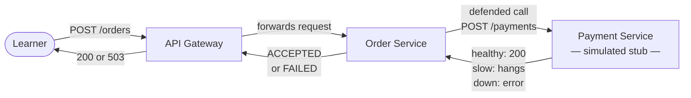
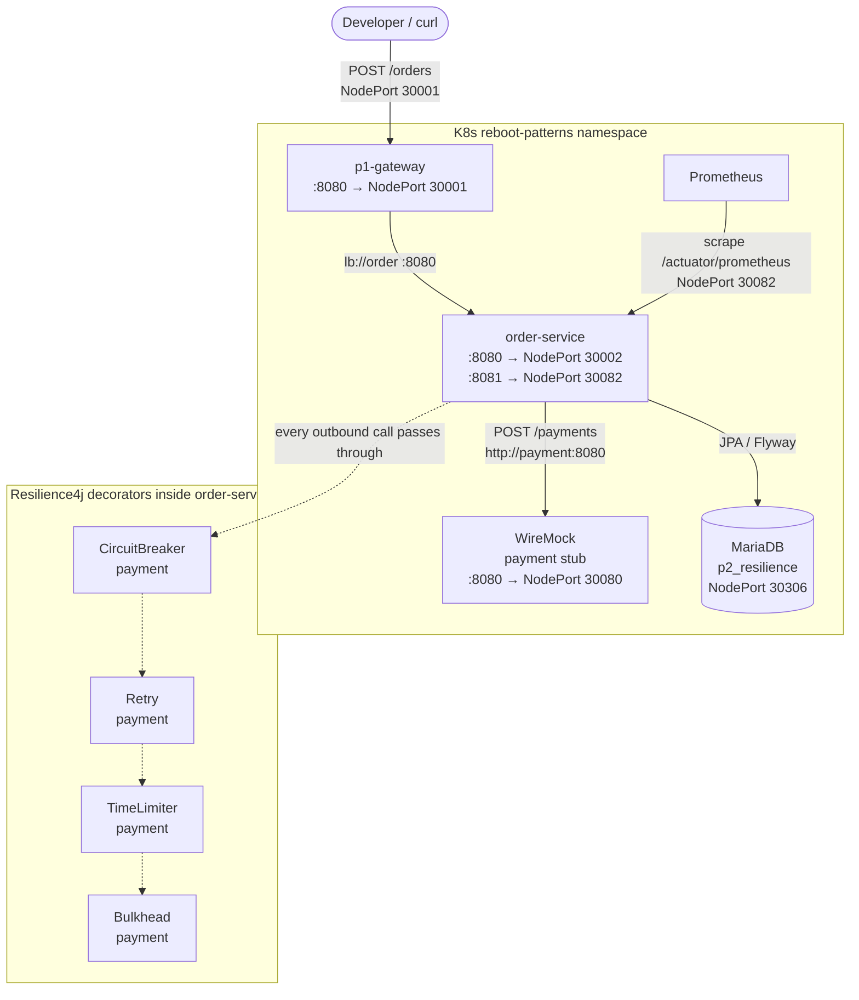
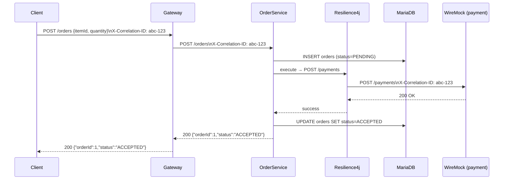
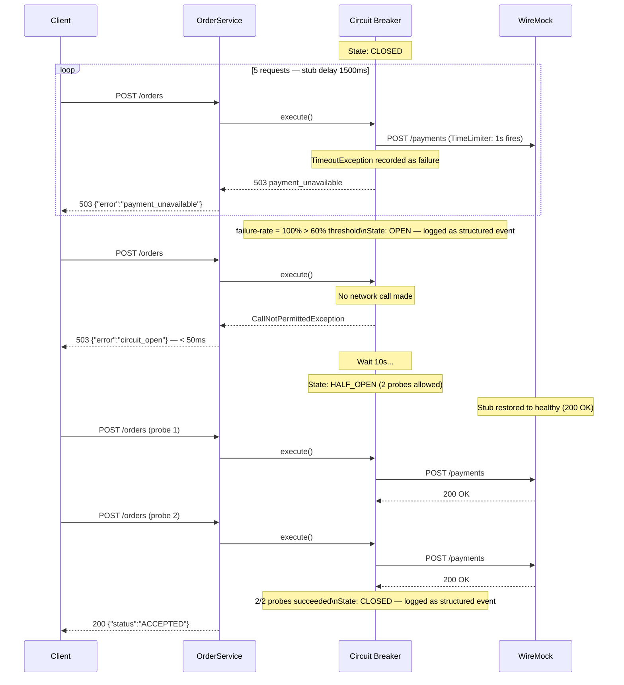
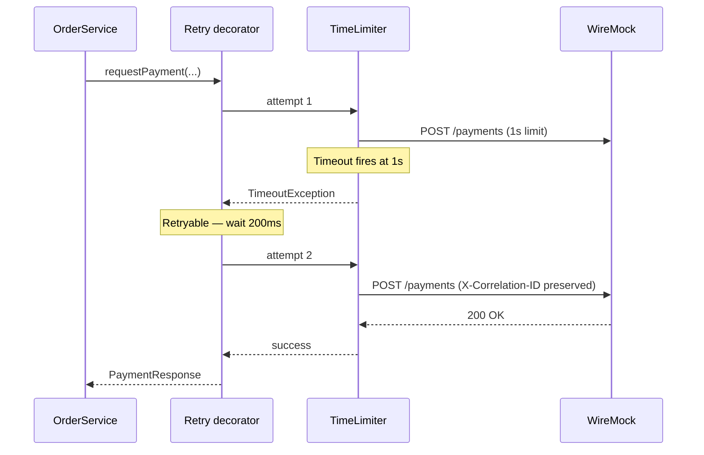
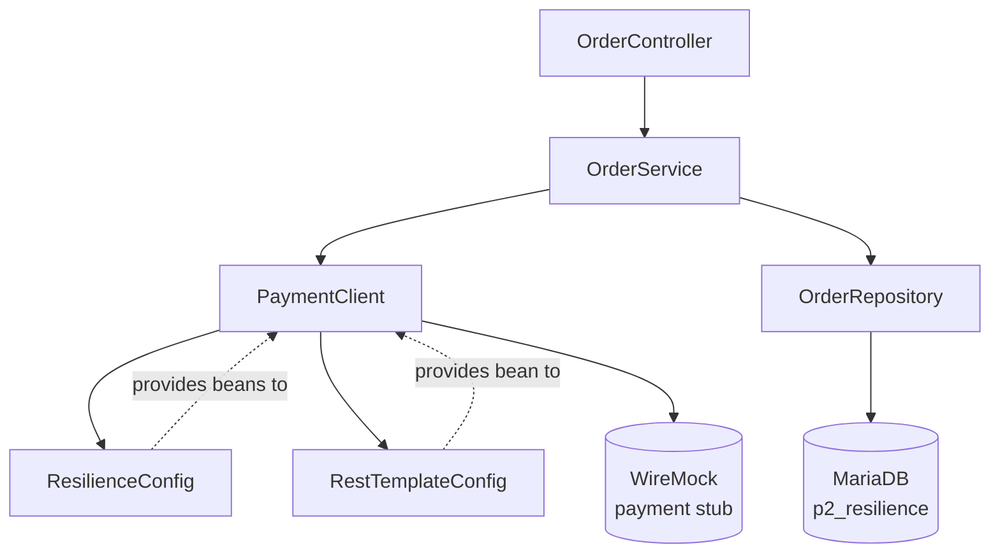

# Spec: p2-resilience — Defended Outbound Calls

---

## Part 1 — Business Spec

### Problem Statement

Every later pattern in the curriculum (outbox, sagas, idempotency, tracing) assumes that service-to-service calls fail **fast and predictably**. Without that foundation, debugging later patterns requires solving two problems at once: the pattern under study, and the raw failure shape of an unprotected HTTP call.

The hardest failure mode is not a dead downstream — it is a slow one. A downstream that hangs ties up the caller's resources indefinitely. Left unchecked, one slow dependency can exhaust the caller's capacity and bring down services that have nothing to do with the failing dependency.

This pattern installs the defensive call as the default unit of communication, before any data-consistency work begins.

### Scope

- An `order` service that accepts order requests and calls a downstream `payment` service to process them.
- Four safety mechanisms wrapping every outbound call:
  - **Circuit breaker** — stops calling a failing downstream and recovers automatically.
  - **Retry** — re-attempts transient failures with a backoff delay.
  - **Timeout** — gives up on a slow call after a defined upper bound.
  - **Bulkhead** — caps how many calls can be in flight at once.
- Observable system: structured logs per call outcome, metrics for monitoring.
- A runnable proof test that drives the full failure-and-recovery lifecycle.

### Out of Scope

- A real payment service (a simulated stub handles all payment calls).
- Protecting the order service from too many inbound requests.
- Automatic threshold tuning.
- Queuing failed orders for later retry (that is the outbox pattern).
- Sharing circuit breaker state across multiple order service instances.
- Monitoring dashboards.
- Compensating transactions, idempotency keys, or dead-letter queues.

### User Stories

**US-1** — As a learner, I can place an order through the system and see it succeed end-to-end when the payment service is healthy, so that I understand the happy-path flow through all four defences.

**US-2** — As a learner, I can see that a slow payment service causes the order service to time out and return a clear error within a bounded time, so that I understand why every call must have an upper time limit.

**US-3** — As a learner, I can see the circuit breaker open after repeated payment failures and watch subsequent calls fast-fail without touching the payment service, so that I understand how the system stops calling a dependency it knows is broken.

**US-4** — As a learner, I can see the circuit breaker move to half-open after a wait period, allow a small number of probe calls through, and then close once the payment service recovers, so that I understand automatic recovery without human intervention.

**US-5** — As a learner, I can see that a burst of concurrent order requests above the configured cap is rejected immediately with a clear capacity error, while requests within the cap continue to be served, so that I understand how one slow dependency is prevented from exhausting caller resources.

**US-6** — As a learner, I can read all resilience thresholds for the payment dependency in one place and explain what each number means, so that I understand how to configure and tune defences declaratively.

**US-7** — As a learner, I can trace a single order request through the system using a correlation ID that is preserved on every retry attempt, so that I understand how end-to-end traceability works across retried calls.

### Acceptance Criteria

**AC for US-1:**
- `POST /orders` with a valid body returns `200` with `{"status":"ACCEPTED"}`.
- The correlation ID supplied by the caller is visible in the payment stub's received request log.

**AC for US-2:**
- With the payment stub configured to respond after 1 500 ms, `POST /orders` returns `503 {"error":"payment_unavailable"}` within approximately 1 100 ms.
- The response is never a hung connection.

**AC for US-3:**
- After 5 calls all timing out, the next call returns `503 {"error":"circuit_open"}` in under 50 ms (no network call made).
- The circuit breaker state change is visible in the structured logs.

**AC for US-4:**
- After a 10-second wait, the circuit breaker enters half-open and allows probe calls through to the payment stub.
- Once the stub is restored to healthy, two successful probes close the breaker and normal `200` responses resume.

**AC for US-5:**
- Firing more than 10 concurrent `POST /orders` requests causes excess requests to return `503 {"error":"capacity_exhausted"}` immediately.
- In-cap requests continue to be served normally.

**AC for US-6:**
- `application.properties` contains one named resilience policy for `payment` with all thresholds (failure rate, wait window, retry count, timeout, concurrency cap) visible as explicit properties with comments.

**AC for US-7:**
- The `X-Correlation-ID` header supplied by the caller is present in every payment stub request log entry, including requests made on retry attempts.

### High-Level Flow



### Alternatives & Trade-offs (Business-Level)

**Why four separate defences instead of one?**
Each defence guards against a distinct failure mode. A timeout stops waiting; a retry recovers from transience; a circuit breaker stops trying; a bulkhead limits blast radius. Combining them is not redundant — they complement each other. Omitting any one leaves a gap the others cannot fill.

**Why a simulated payment service?**
A real payment service would introduce its own failure behaviour, making it impossible to control the exact conditions needed to demonstrate each defence in isolation. The simulation lets the test script configure exactly how the downstream misbehaves.

**Why automatic recovery?**
Requiring a human to reset the circuit breaker would make every downstream outage an on-call event. Automatic half-open → close behaviour is the production standard and is what every later pattern relies on.

---

## Part 2 — Technical Assessment

### Architecture Diagram



### Workflow Diagrams

#### Happy Path



#### Circuit Breaker Full Lifecycle



#### Retry Sequence



### Key Technical Decisions

| Decision | Choice | Rationale |
|---|---|---|
| HTTP client | `RestTemplate` | Blocking / linear model; no Mono/Flux prerequisite; Resilience4j decorates synchronous suppliers cleanly |
| Resilience4j integration | Programmatic beans in `ResilienceConfig` + `application.properties` thresholds | All wiring visible in one file; no AOP magic; explicit `@Bean` declarations per CLAUDE.md beginner-mode rule |
| Bulkhead type | Semaphore | Fits servlet container's thread model; instant rejection on cap; simpler config than thread-pool bulkhead |
| CB → Retry → TimeLimiter → Bulkhead decoration order | CB outermost, Bulkhead innermost | Each retry attempt counts as a separate CB window entry → breaker opens faster; bulkhead guards the innermost network call |
| Per-call timeout | 1 second | Worst case (3 attempts × 1s + 2 × 200ms backoff = 3.4s) stays comfortably under gateway's 5s global limit |
| Retryable failures | `TimeoutException` + `IOException` only | HTTP responses (including 5xx) are not retried — avoids duplicate payment risk and teaches the retryable-vs-non-retryable distinction |
| CB thresholds | window=5, min=5, 60% rate, 10s wait, 2 half-open probes | Conservative: breaker opens after 3/5 failures; full lifecycle runs in ~30s on a developer laptop |
| Payment URL | `http://payment:8080` (hardcoded ClusterIP name) | `payment` ClusterIP already exists from p1-gateway's `stub-services.yaml`; no Spring Cloud Kubernetes RBAC needed |
| Log emission | Resilience4j event listeners in `ResilienceConfig` | Service code stays clean; all observability wiring in one `@Configuration` class |
| Log field names | `dependency`, `outcome`, `attemptCount`, `latencyMs`, `correlationId` | Consistent with p1-gateway's `correlationId`, `latencyMs` field names |
| NodePorts | 30002 (app), 30082 (actuator) | Sequential convention: p1 = 30001/30081, p2 = 30002/30082 |

### Module Decomposition

> 💡 A deep module encapsulates significant functionality behind a simple, stable interface. Prefer fewer, deeper modules over many shallow ones. Each module below is a unit that can be developed and tested in isolation.

| Module | Responsibility | Public Interface | New / Modified | Test Seam |
|---|---|---|---|---|
| `OrderController` | HTTP entry point — validates request, delegates to service, maps outcomes to HTTP status | `POST /orders` | New | `MockMvc` or `curl` via NodePort |
| `OrderService` | Orchestrates: persist `PENDING`, call `PaymentClient`, update status to `ACCEPTED`/`FAILED` | `placeOrder(itemId, quantity, correlationId) → OrderResult` | New | Stub `PaymentClient` |
| `Order` (entity) | Persistent record of an order placement attempt | JPA entity; `id`, `itemId`, `quantity`, `status`, `createdAt` | New | `OrderRepository` |
| `OrderRepository` | JPA persistence for `Order` | `save(Order)`, `findById(Long)` | New | Real MariaDB via NodePort |
| `PaymentClient` | Outbound HTTP call to payment stub, decorated with all four Resilience4j defences | `requestPayment(PaymentRequest, correlationId) → PaymentResult` | New | WireMock via NodePort 30080 |
| `ResilienceConfig` | Wires `CircuitBreaker`, `Retry`, `TimeLimiter`, `Bulkhead` beans for the `payment` policy; registers event listeners for structured logging | Spring `@Configuration` / `@Bean` | New | `CircuitBreakerRegistry`, `RetryRegistry` assertions in unit test |
| `RestTemplateConfig` | Provides the `RestTemplate` `@Bean` | Spring `@Bean` | New | None (infrastructure) |

#### Module Dependency Diagram



### Dependencies

| Dependency | Catalog Key | Purpose |
|---|---|---|
| `spring-boot-starter-web` | `libs.spring.boot.starter.web` | Servlet-based Spring MVC (not reactive) |
| `spring-boot-starter-data-jpa` | `libs.spring.boot.starter.data.jpa` | JPA + Hibernate for `Order` entity |
| `spring-boot-starter-actuator` | `libs.spring.boot.starter.actuator` | Health + metrics endpoints |
| `resilience4j-spring-boot3` | `libs.resilience4j.spring.boot3` | CB, Retry, TimeLimiter, Bulkhead auto-config + Micrometer bridge |
| `micrometer-registry-prometheus` | `libs.micrometer.registry.prometheus` | Prometheus scrape endpoint |
| `flyway-core` | `libs.flyway.core` | Schema migrations |
| `flyway-mysql` | `libs.flyway.mysql` | MariaDB-compatible Flyway dialect |
| `mariadb-java-client` | `libs.mariadb.java.client` | JDBC driver |
| `logstash-logback-encoder` | `libs.logstash.logback.encoder` | Structured JSON logging |

> ℹ️ **1 manday = 1 hour** (~2 sessions × 30 minutes)

### Task Breakdown

#### Slice 0: Gradle Subproject + Data Layer

> Establishes the buildable subproject, schema, and persistence layer. No HTTP surface yet — enables all subsequent slices.

| # | Task | Complexity | Mandays | Risk | Covers |
|---|------|------------|---------|------|--------|
| 0.1 | Create `patterns/p2-resilience` Gradle subproject: `build.gradle`, `Dockerfile`, update `settings.gradle`, `OrderApplication.java`, `application.properties` skeleton | Medium | 1.0 | Low | Foundation |
| 0.2 | Flyway `V001__init.sql`: create `p2_resilience` schema + `orders` table; wire `Order` `@Entity` + `OrderRepository` | Low | 0.5 | Low | Foundation |

**Slice 0 subtotal: 1.5 mandays**

---

#### Slice 1: Order API + Plain Payment Integration

> Delivers a working `POST /orders` that persists an order and calls the payment stub via a plain (undefended) `RestTemplate`. Demos: curl hits the order service, order is stored, payment stub is called.

| # | Task | Complexity | Mandays | Risk | Covers |
|---|------|------------|---------|------|--------|
| 1.1 | `RestTemplateConfig` + `PaymentClient` (plain `RestTemplate`, no Resilience4j); configure `payment.base-url=http://payment:8080` | Low | 0.5 | Low | US-1 |
| 1.2 | `OrderController` (`POST /orders`) + `OrderService` (persist `PENDING`, call `PaymentClient`, update `ACCEPTED`/`FAILED`); typed error response body (`payment_unavailable`) | Medium | 1.0 | Low | US-1 |
| 1.3 | K8s `Deployment` + `Service` manifests (NodePort 30002/30082); readiness and liveness probes; verify `GET /actuator/health` and `POST /orders` reachable from laptop | Low | 0.5 | Low | Foundation |

**Slice 1 subtotal: 2.0 mandays**

---

#### Slice 2: Resilience4j Wiring

> Wraps the payment call with all four defences. After this slice, every success criterion for CB, retry, timeout, and bulkhead can be manually verified with curl.

| # | Task | Complexity | Mandays | Risk | Covers |
|---|------|------------|---------|------|--------|
| 2.1 | `ResilienceConfig`: declare `CircuitBreaker`, `Retry`, `TimeLimiter`, `Bulkhead` beans for the `payment` policy with all thresholds in `application.properties` | Medium | 1.0 | Medium | US-2 US-3 US-4 US-5 US-6 |
| 2.2 | Decorate `PaymentClient.requestPayment()` with all four defences (CB → Retry → TimeLimiter → Bulkhead order); map `CallNotPermittedException` → `circuit_open`, `TimeoutException` → `payment_unavailable`, `BulkheadFullException` → `capacity_exhausted` | High | 1.0 | High | US-2 US-3 US-4 US-5 |
| 2.3 | Event listeners in `ResilienceConfig`: log structured JSON per call outcome (`dependency`, `outcome`, `attemptCount`, `latencyMs`, `correlationId`) and per CB state transition (`from`, `to`, `dependency`); verify Prometheus metrics at `/actuator/prometheus` | Medium | 1.0 | Medium | US-6 US-7 |

**Slice 2 subtotal: 3.0 mandays**

---

#### Slice 3: Bash Test — Canonical Failure

> The definition-of-done gate. After this slice, the canonical-failure bash test passes against the shared K8s cluster.

| # | Task | Complexity | Mandays | Risk | Covers |
|---|------|------------|---------|------|--------|
| 3.1 | `tests/p2-resilience/reset.sh`: truncate `p2_resilience` schema (drop + recreate); delete WireMock stubs tagged `pattern: p2` | Low | 0.5 | Low | Foundation |
| 3.2 | `tests/p2-resilience/canonical-failure.sh`: 9-step script driving the full CB lifecycle (healthy call → slow stub → timeout × 5 → fast-fail → 10s wait → half-open probe → recovery); assert correlation-id presence on all WireMock requests including retries | High | 2.0 | High | US-1 – US-7 |

**Slice 3 subtotal: 2.5 mandays**

---

### Total Estimate & Critical Path

| Slice | Mandays |
|---|---------|
| Slice 0: Gradle Subproject + Data Layer | 1.5 |
| Slice 1: Order API + Plain Payment Integration | 2.0 |
| Slice 2: Resilience4j Wiring | 3.0 |
| Slice 3: Bash Test — Canonical Failure | 2.5 |
| **Total** | **9.0** |

**Critical path:** Slice 0 → Slice 1 → Slice 2 → Slice 3. Each slice depends on the previous. No parallel tracks.

**Definition of Done:** `tests/p2-resilience/canonical-failure.sh` passes against the shared Kubernetes cluster.

---

### Risk Assessment

#### High Risks

**R1 — CB × Retry window interaction**
Each retry attempt counts as a separate entry in the circuit breaker's sliding window (window=5, min=5). With 3 total attempts per logical request, the breaker can open after as few as 2 logical requests. The canonical-failure test must account for this: driving exactly 5 *logical* requests is not necessary — 2 requests (each with 2 retries + 1 original = 6 window entries) is sufficient to open the breaker. The test must assert on observable outcomes (fast-fail time < 50ms), not on exact attempt counts.

**R2 — Correlation-ID loss through TimeLimiter's executor**
`TimeLimiter` submits the call to a `ScheduledExecutorService`. MDC context (which carries `correlationId`) does not automatically propagate across thread boundaries in Java. The `PaymentClient` must explicitly copy the MDC map before submitting and restore it inside the supplier.

**R3 — Canonical-failure test timing on a loaded machine**
The 10-second `wait-duration-in-open-state` and the WireMock `fixedDelayMilliseconds: 1500` must be robust to Colima VM load variability. Add `sleep` buffers and tolerance margins in the test assertions.

#### Medium Risks

**R4 — Threshold calibration**
Failure rate (60%), slow-call rate (80%), and slow-call duration threshold (1s) interact. A slow call that times out at 1s also counts against the failure-rate window. Both `failure-rate-threshold` and `slow-call-rate-threshold` can independently open the breaker. The test must explicitly configure WireMock to produce delays > 1s so both thresholds are exceeded consistently.

**R5 — Scope creep into p3**
The natural reflex after seeing a payment failure is to add a fallback that queues the order. Doing so pre-empts the outbox pattern and dilutes both lessons. Any queuing behaviour must be deferred.

#### Low Risks

**R6 — NodePort conflicts**
Ports 30002/30082 may be taken by a leftover Kubernetes service from an earlier experiment. Verify with `kubectl get svc -n reboot-patterns` before deploying.

#### Mitigation Strategies

| Risk | Mitigation |
|---|---|
| R1 | Test asserts on response time (< 50ms for fast-fail), not on attempt counts |
| R2 | `PaymentClient` captures `MDC.getCopyOfContextMap()` before `TimeLimiter` submission; restores in the inner `Callable` |
| R3 | `canonical-failure.sh` uses `sleep 12` after the open state to give 2s margin above the 10s wait duration |
| R4 | Set `slow-call-duration-threshold=1s` explicitly; WireMock delay set to 1500ms to exceed it by 50% |
| R5 | Code review gate: no `Kafka*`, no `outbox`, no queueing in p2 classes |
| R6 | `reset.sh` checks for NodePort conflicts and exits with an informative error if found |

---

## Part 3 — Issue-Ready Breakdown

> Each issue is a self-contained work item traceable to a User Story. Behaviors are expressed as observable outcomes through public interfaces only — never as internal state (DB rows, Redis keys, outbox tables). Tests verify behavior through public APIs.

---

### Slice 0: Gradle Subproject + Data Layer

> Establishes the buildable, deployable subproject with its persistence layer. No HTTP surface yet. Completing this slice means the app boots, connects to MariaDB, and runs Flyway migrations successfully.

#### ISSUE-1: Gradle Subproject Scaffold

- **Description:** Create the `patterns/p2-resilience` Gradle subproject with all build boilerplate: `build.gradle` referencing `libs.*` from the version catalog, `Dockerfile` (single-stage `eclipse-temurin:21-jre`), entry in `settings.gradle`, `OrderApplication.java`, and an `application.properties` skeleton with `spring.application.name=p2-order`, server ports, MariaDB connection to NodePort 30306, and the `p2_resilience` schema.
- **User Stories:** Foundation for all US
- **Modules touched:** `OrderApplication` (new), `RestTemplateConfig` (new — stub it empty for now)
- **Public Interface:** `./gradlew :patterns:p2-resilience:build` succeeds; `java -jar` boots without errors.
- **Behaviors to verify (in priority order):**
  1. `./gradlew :patterns:p2-resilience:build` compiles without errors.
  2. Application starts and `/actuator/health` returns `{"status":"UP"}` when MariaDB is reachable.
  3. Application fails to start with a clear error when MariaDB is unreachable (fast-fail on misconfiguration).
- **Acceptance Criteria:** Subproject builds, boots, and passes health check against the running MariaDB NodePort.
- **Estimated Mandays:** 1.0
- **Dependencies:** None
- **Risk:** Low

---

#### ISSUE-2: Order Entity + Flyway Migration

- **Description:** Write Flyway migration `V001__init.sql` that creates the `orders` table in the `p2_resilience` schema. Wire the `Order` `@Entity` (fields: `id`, `itemId`, `quantity`, `status`, `createdAt`) and `OrderRepository` (`JpaRepository<Order, Long>`). Add a 1-line "why this exists" comment to the `Order` class explaining it is the root aggregate for the order placement flow.
- **User Stories:** Foundation for US-1
- **Modules touched:** `Order` (new entity), `OrderRepository` (new)
- **Public Interface:** `OrderRepository.save(order)` and `findById(id)` — exercised indirectly through the service in later slices.
- **Behaviors to verify (in priority order):**
  1. On first boot, Flyway creates `p2_resilience.orders` table without errors.
  2. On second boot, Flyway detects no pending migrations and boots cleanly (idempotent).
- **Acceptance Criteria:** `p2_resilience.orders` table exists with the correct schema after boot; subsequent boots succeed without re-running V001.
- **Estimated Mandays:** 0.5
- **Dependencies:** ISSUE-1
- **Risk:** Low

---

### Slice 1: Order API + Plain Payment Integration

> Delivers a working `POST /orders` end-to-end with a plain (undefended) RestTemplate call. After this slice, a curl from a laptop reaches the order service via the gateway, an order row is persisted, and the payment stub is called. No resilience defences yet.

#### ISSUE-3: PaymentClient (Plain RestTemplate)

- **Description:** Implement `PaymentClient.requestPayment(PaymentRequest request, String correlationId)` using a `RestTemplate` bean from `RestTemplateConfig`. The client sets the `X-Correlation-ID` header on the outbound request. Add a "why this exists" comment explaining this is the outbound call that all four Resilience4j defences will later wrap. No retry, no circuit breaker yet.
- **User Stories:** US-1, US-7
- **Modules touched:** `PaymentClient` (new), `RestTemplateConfig` (complete)
- **Public Interface:** `PaymentClient.requestPayment(PaymentRequest, correlationId)` returns `PaymentResult` (success) or throws on HTTP error / connection failure.
- **Behaviors to verify (in priority order):**
  1. A call to a WireMock stub returning `200 {"result":"approved"}` produces a `PaymentResult` with success status.
  2. The outbound request carries the `X-Correlation-ID` header matching the value passed in.
  3. A call to a WireMock stub returning `500` throws a `RestClientResponseException`.
  4. A call to an unreachable host throws a `ResourceAccessException`.
- **Acceptance Criteria:** `PaymentClient` sends `X-Correlation-ID` on every call; responses are correctly mapped; errors propagate as typed exceptions.
- **Estimated Mandays:** 0.5
- **Dependencies:** ISSUE-1
- **Risk:** Low

---

#### ISSUE-4: OrderController + OrderService

- **Description:** Implement `OrderController` with `POST /orders` accepting `{"itemId": "...", "quantity": N}`. `OrderService.placeOrder()` persists an `Order` with status `PENDING`, calls `PaymentClient.requestPayment()`, then updates the order status to `ACCEPTED` (on success) or `FAILED` (on exception). Returns `200 {"orderId": N, "status": "ACCEPTED"}` or `503 {"error": "payment_unavailable"}`. Add a "why this exists" comment on `OrderService` explaining it is the main application flow that the resilience wiring will make safe.
- **User Stories:** US-1
- **Modules touched:** `OrderController` (new), `OrderService` (new)
- **Public Interface:** `POST /orders` HTTP endpoint.
- **Behaviors to verify (in priority order):**
  1. `POST /orders {"itemId":"ITEM-1","quantity":1}` with a healthy payment stub returns `200 {"orderId": <id>, "status": "ACCEPTED"}`.
  2. `POST /orders` with a payment stub returning `500` returns `503 {"error": "payment_unavailable"}`.
  3. `POST /orders` with a missing/malformed body returns `400`.
  4. `X-Correlation-ID` from the inbound request is forwarded to the payment stub.
- **Acceptance Criteria:** Happy-path order placement returns 200; payment failure returns 503 with a machine-readable error key; correlation ID is propagated end-to-end.
- **Estimated Mandays:** 1.0
- **Dependencies:** ISSUE-2, ISSUE-3
- **Risk:** Low

---

#### ISSUE-5: K8s Manifests + Deployment Verification

- **Description:** Write `k8s/01-deployment.yaml` (1 replica, image `localhost:30500/p2-order:latest`, ports 8080/8081, readiness probe `GET /actuator/health` with 15s initial delay, liveness probe with 30s initial delay) and `k8s/02-service.yaml` (NodePort 30002 → 8080, NodePort 30082 → 8081). Build and push the image via `scripts/build-and-push.sh`. Deploy and verify the service is reachable.
- **User Stories:** Foundation
- **Modules touched:** K8s manifests (new)
- **Public Interface:** `http://localhost:30002/orders` (direct), `http://localhost:30001/orders` (via gateway), `http://localhost:30082/actuator/health`.
- **Behaviors to verify (in priority order):**
  1. `GET http://localhost:30082/actuator/health` returns `{"status":"UP"}` after deployment.
  2. `POST http://localhost:30002/orders` (direct NodePort) returns a valid response.
  3. `POST http://localhost:30001/orders` (via gateway) returns a valid response with `X-Correlation-ID` injected.
- **Acceptance Criteria:** Order service is reachable via both direct NodePort and gateway; health probe passes; image built for `linux/amd64`.
- **Estimated Mandays:** 0.5
- **Dependencies:** ISSUE-4
- **Risk:** Low (NodePort 30002/30082 must not conflict — check with `kubectl get svc -n reboot-patterns`)

---

### Slice 2: Resilience4j Wiring

> Wraps the payment call with all four defences. After this slice, every resilience defence can be manually triggered with curl and WireMock stub manipulation. No bash test yet.

#### ISSUE-6: ResilienceConfig — Bean Declarations + application.properties Thresholds

- **Description:** Create `ResilienceConfig` `@Configuration` class with explicit `@Bean` definitions for `CircuitBreaker`, `Retry`, `TimeLimiter`, and `Bulkhead` for the `payment` policy, all reading their thresholds from `application.properties`. Add a "why this exists" comment explaining this is the single configuration surface for the defended payment call. All thresholds must be visible as named properties with inline comments explaining each value.

  Required thresholds in `application.properties`:
  ```
  # Circuit breaker
  resilience4j.circuitbreaker.instances.payment.sliding-window-size=5
  resilience4j.circuitbreaker.instances.payment.minimum-number-of-calls=5
  resilience4j.circuitbreaker.instances.payment.failure-rate-threshold=60
  resilience4j.circuitbreaker.instances.payment.slow-call-duration-threshold=1s
  resilience4j.circuitbreaker.instances.payment.slow-call-rate-threshold=80
  resilience4j.circuitbreaker.instances.payment.wait-duration-in-open-state=10s
  resilience4j.circuitbreaker.instances.payment.permitted-number-of-calls-in-half-open-state=2
  # Retry
  resilience4j.retry.instances.payment.max-attempts=3
  resilience4j.retry.instances.payment.wait-duration=200ms
  # TimeLimiter
  resilience4j.timelimiter.instances.payment.timeout-duration=1s
  # Bulkhead (semaphore)
  resilience4j.bulkhead.instances.payment.max-concurrent-calls=10
  resilience4j.bulkhead.instances.payment.max-wait-duration=0ms
  ```

- **User Stories:** US-2, US-3, US-4, US-5, US-6
- **Modules touched:** `ResilienceConfig` (new)
- **Public Interface:** Spring `@Bean` — `CircuitBreakerRegistry`, `RetryRegistry`, `TimeLimiterRegistry`, `BulkheadRegistry`.
- **Behaviors to verify (in priority order):**
  1. Application context loads without errors when all four beans are declared.
  2. `GET /actuator/health` includes `circuitBreakers` component showing `payment` in `CLOSED` state.
  3. `GET /actuator/prometheus` includes `resilience4j_circuitbreaker_state{name="payment"}` metric.
- **Acceptance Criteria:** All four Resilience4j beans present in context; CB health indicator active; Prometheus metrics exposed.
- **Estimated Mandays:** 1.0
- **Dependencies:** ISSUE-1
- **Risk:** Medium (CB × Retry window interaction — see R1 in risk assessment; the decoration order in ISSUE-7 is what determines this)

---

#### ISSUE-7: Decorate PaymentClient with All Four Defences

- **Description:** Decorate `PaymentClient.requestPayment()` with the four Resilience4j instances in the order: CB (outermost) → Retry → TimeLimiter → Bulkhead (innermost). Each retry attempt must copy and restore the MDC context map to preserve `correlationId` across the `TimeLimiter`'s executor thread boundary. Map exceptions to typed error results:
  - `CallNotPermittedException` → `PaymentResult.circuitOpen()`
  - `TimeoutException` / `BulkheadFullException` caught after TimeLimiter/Bulkhead → `PaymentResult.unavailable()`
  - `BulkheadFullException` at bulkhead → `PaymentResult.capacityExhausted()`

  `OrderController` maps these to `503` with the corresponding `{"error": "circuit_open"}`, `{"error": "payment_unavailable"}`, `{"error": "capacity_exhausted"}` bodies.

- **User Stories:** US-2, US-3, US-4, US-5, US-7
- **Modules touched:** `PaymentClient` (modified), `OrderController` (modified)
- **Public Interface:** `POST /orders` — response body `{"error": "..."}` distinguishes all failure modes.
- **Behaviors to verify (in priority order):**
  1. With WireMock stub delay 1500ms, `POST /orders` returns `503 {"error":"payment_unavailable"}` in approximately 1100ms (timeout fires at 1s + some overhead).
  2. After 5 calls all timing out, the 6th call returns `503 {"error":"circuit_open"}` in under 50ms.
  3. `POST /orders` when breaker is closed and stub is healthy returns `200 {"status":"ACCEPTED"}`.
  4. With 15 concurrent requests, at least 5 return `503 {"error":"capacity_exhausted"}`.
  5. `X-Correlation-ID` is present on the WireMock request log for every attempt, including retry attempts (verify via `GET http://localhost:30080/__admin/requests`).
- **Acceptance Criteria:** All four failure modes produce distinguishable `503` responses; correlation ID is never dropped across retries; healthy calls return 200.
- **Estimated Mandays:** 1.0
- **Dependencies:** ISSUE-5, ISSUE-6
- **Risk:** High — MDC propagation across `TimeLimiter` thread is the most fragile part; test correlation-id assertion (behavior 5) is the proof.

---

#### ISSUE-8: Event Listeners + Structured Logging

- **Description:** Register event listeners on all four Resilience4j instances inside `ResilienceConfig`. Each listener emits a structured JSON log line via Logstash markers. Listeners to register:
  - `CircuitBreaker.EventPublisher.onSuccess`, `onError`, `onTimeout`, `onCallNotPermitted`, `onStateTransition`
  - `Retry.EventPublisher.onRetry`, `onSuccess`, `onError`
  - `TimeLimiter.EventPublisher.onTimeout`, `onSuccess`
  - `Bulkhead.EventPublisher.onCallRejected`, `onCallFinished`

  Required JSON fields per event: `dependency` (always `"payment"`), `outcome` (e.g. `"success"`, `"timeout"`, `"circuit_open"`, `"retry"`, `"bulkhead_rejected"`), `attemptCount` (where available), `latencyMs` (where available), `correlationId` (from MDC).

  CB state transition log must include `from` and `to` state names.

- **User Stories:** US-6, US-7
- **Modules touched:** `ResilienceConfig` (modified)
- **Public Interface:** Structured log output — readable via `kubectl logs` on the order pod.
- **Behaviors to verify (in priority order):**
  1. A healthy `POST /orders` produces a log line with `outcome=success`, `dependency=payment`, and `correlationId` matching the inbound header.
  2. A timed-out call produces a log line with `outcome=timeout`.
  3. A circuit breaker opening produces a log line with `from=CLOSED`, `to=OPEN`.
  4. A retry produces a log line with `outcome=retry` and `attemptCount > 1`.
  5. A bulkhead rejection produces a log line with `outcome=bulkhead_rejected`.
- **Acceptance Criteria:** All five log event types visible in `kubectl logs` during manual curl testing; no log line missing `correlationId` when header was supplied.
- **Estimated Mandays:** 1.0
- **Dependencies:** ISSUE-7
- **Risk:** Medium — MDC availability inside event listener callbacks depends on thread context; verify during manual testing before the bash test.

---

### Slice 3: Bash Test — Canonical Failure

> The definition-of-done gate. After this slice, the canonical-failure test passes cleanly against the shared Kubernetes cluster with a single `bash tests/p2-resilience/canonical-failure.sh` invocation.

#### ISSUE-9: reset.sh

- **Description:** Write `tests/p2-resilience/reset.sh`. Must be idempotent. Steps:
  1. Drop and recreate the `p2_resilience` schema on MariaDB NodePort 30306.
  2. Delete all WireMock stubs tagged `"pattern": "p2"` via `DELETE http://localhost:30080/__admin/mappings` (filtered by metadata).
  3. Print confirmation that reset completed.

  Every step must echo a descriptive status line and exit 1 on failure.

- **User Stories:** Foundation
- **Modules touched:** None (test infrastructure)
- **Public Interface:** `source ./tests/p2-resilience/reset.sh` — exits 0 on success, 1 on failure.
- **Behaviors to verify (in priority order):**
  1. Running `reset.sh` twice in a row exits 0 both times (idempotent).
  2. After `reset.sh`, `p2_resilience.orders` is empty.
  3. After `reset.sh`, WireMock has no stubs tagged `pattern: p2`.
- **Acceptance Criteria:** Script is idempotent; schema is clean; WireMock stubs are cleared after execution.
- **Estimated Mandays:** 0.5
- **Dependencies:** ISSUE-5
- **Risk:** Low

---

#### ISSUE-10: canonical-failure.sh — Full Circuit Breaker Lifecycle

- **Description:** Write `tests/p2-resilience/canonical-failure.sh`. The script must `source ./tests/p2-resilience/reset.sh` as its first action, then execute the following 9 steps in order, echoing `"Step N: <action>"` before each step and asserting loudly on failure with `exit 1`.

  | Step | Action | Assertion |
  |------|--------|-----------|
  | 1 | Reset | reset.sh exits 0 |
  | 2 | POST WireMock stub: `POST /payments` → `200 {"result":"approved"}`, metadata `pattern: p2` | Stub created (201) |
  | 3 | `POST /orders` — healthy call | HTTP 200; `{"status":"ACCEPTED"}`; `X-Correlation-ID` visible in WireMock request log |
  | 4 | Update WireMock stub: `fixedDelayMilliseconds: 1500` | Stub updated |
  | 5 | Drive 5 × `POST /orders` — each times out | Each returns 503; response time < 1100ms per call |
  | 6 | Drive 1 × `POST /orders` — fast-fail assertion | HTTP 503 `{"error":"circuit_open"}`; response time < 50ms (no WireMock call made) |
  | 7 | `sleep 12` — wait for open state to expire | — |
  | 8 | Update WireMock stub back to healthy (`200`, no delay) | Stub updated |
  | 9 | Drive 2 × `POST /orders` — half-open probes + closure | Both return 200; WireMock received the probe requests; `X-Correlation-ID` present on all requests in WireMock log including retry attempts from step 5 |

  Correlation-ID assertion (steps 3 and 9): use `GET http://localhost:30080/__admin/requests` and verify every request has a non-empty `X-Correlation-ID` header.

- **User Stories:** US-1, US-2, US-3, US-4, US-5, US-6, US-7
- **Modules touched:** None (test infrastructure)
- **Public Interface:** `bash tests/p2-resilience/canonical-failure.sh` — exits 0 on full pass, 1 on any assertion failure.
- **Behaviors to verify (in priority order):**
  1. Script exits 0 against the running cluster.
  2. Fast-fail response time in step 6 is < 50ms.
  3. Recovery in step 9 produces HTTP 200 (not 503).
  4. All WireMock request log entries contain `X-Correlation-ID`.
- **Acceptance Criteria:** `canonical-failure.sh` exits 0 against the shared Kubernetes cluster. This is the pattern's definition of done.
- **Estimated Mandays:** 2.0
- **Dependencies:** ISSUE-8, ISSUE-9
- **Risk:** High — WireMock delay precision and CB×Retry window interaction (R1, R3) make this the most timing-sensitive task. Build in `sleep` buffers and tolerance margins (see mitigation table in Part 2).
